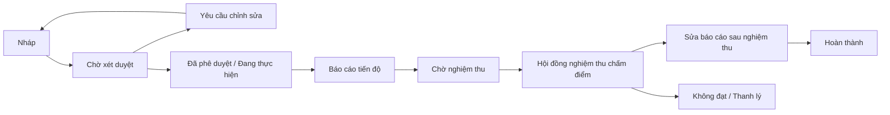
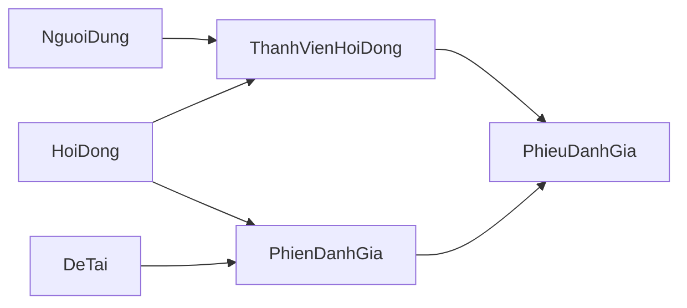

# Kiểm tra cấu trúc NestJS

> ở mục Nestjs này tôi có 2 foler NCKH và qldtkh trong 2 folder này có 2 phần fe vs be của tôi bạn check xem đúng chưa

<details><summary>3 previous messages</summary>

> Mình sẽ kiểm tra cấu trúc hai dự án `NCKH` và `qldtkh`, xác định phần frontend/backend, rồi rà nhanh cấu hình chạy và các lỗi rõ ràng nếu có.
>
> Đã xác định đúng cặp dự án: `NCKH` là React/Vite frontend, còn `qldtkh\quanlydetai` là NestJS backend. Mình đang kiểm tra hai bên có khớp địa chỉ API/cấu hình chạy hay không, rồi sẽ build để xác nhận.
>
> Kết quả build: backend build thành công; frontend hiện chưa build được vì TypeScript báo 3 biến state khai báo nhưng không dùng. Ngoài ra mình phát hiện một endpoint frontend gọi không tồn tại riêng ở backend, nên phần “kết nối đúng hoàn toàn” thì chưa đạt.
</details>

Đã kiểm tra:

- `D:\NestJs\NCKH` là frontend React + Vite.
- `D:\NestJs\qldtkh\quanlydetai` là backend NestJS.
- FE gọi API `http://localhost:3000`; BE chạy cổng `3000` và đã bật CORS → cấu hình kết nối cơ bản khớp.
- Backend build thành công (`npm run build`).

Nhưng hiện chưa hoàn toàn đúng:

1. Frontend build bị lỗi TypeScript do 3 state khai báo nhưng không dùng trong [ProgressManagement.tsx](./NCKH/src/pages/ProgressManagement.tsx:34): `setCreateOptions`, `milestoneMembers`, `setFetching`.

2. FE gọi `GET /project/approved` trong [TopicService.ts](D:\NestJs\NCKH\src\pages\Quản lý thông tin đề án\TopicService.ts:67), nhưng BE không có endpoint này; nó sẽ bị route `GET /project/:id` bắt và hiểu `"approved"` là mã đề tài. Cần đổi FE sang `/project/state/...` hoặc thêm endpoint `/project/approved` ở BE.

3. Backend chưa có test unit nào: chạy `npm test` báo “No tests found”.

4. Thông tin SQL Server đang ghi thẳng trong [app.module.ts](./qldtkh/quanlydetai/src/app.module.ts:29), gồm cả mật khẩu. Nên chuyển sang biến môi trường `.env`.

Mình chưa sửa file nào.

> ProgressManagement.tsx ở đây tôi bị lỗi logic tìm thành viên trong đề tài để tạo mốc và hiển thị thành viên có trong mốc ở phần sửa với role Trưởng nhóm sửa lỗi cho tôi

<details><summary>4 previous messages</summary>

> Mình sẽ lần theo luồng dữ liệu thành viên từ đề tài → tạo mốc → sửa mốc, kiểm tra role “Trưởng nhóm” ở cả frontend/backend rồi chỉnh đúng phần đang sai.
>
> Nguyên nhân chính là danh sách chọn khi tạo đang đọc từ `createOptions` nhưng state này không bao giờ được nạp từ thành viên đề tài. Phần sửa còn chỉ nạp thành viên đã chọn ở giao diện, nhưng backend lại chưa lưu thay đổi `ThanhVienIds`. Mình sẽ hợp nhất danh sách thành viên theo đề tài, nạp thành viên mốc khi mở Sửa/Xem, và bổ sung lưu phân công khi cập nhật.
>
> <details><summary>Edited 4 files</summary>
>
> - Wrote `./NCKH/src/pages/ProgressManagement.tsx` (+84 -122)
> - Wrote `./NCKH/src/pages/Quản lý thông tin đề án/ProgressService.ts` (+2 -2)
> - Wrote `./qldtkh/quanlydetai/src/dto/UpdateProgressDto.ts` (+5 -2)
> - Wrote `./qldtkh/quanlydetai/src/progress/progress.service.ts` (+24 -5)
>
> </details>
>
> Đã chỉnh xong và cả frontend lẫn backend đều build thành công. Luồng mới bảo đảm Trưởng nhóm thấy toàn bộ thành viên của đề tài để chọn khi tạo/sửa; khi mở Sửa, thành viên đã phân công được tự chọn sẵn và hiển thị rõ; khi lưu thì backend cập nhật lại phân công.
</details>

Đã sửa xong lỗi thành viên cho luồng Trưởng nhóm:

- Tạo mốc: Select nay lấy đúng toàn bộ thành viên của đề tài và tìm kiếm trực tiếp theo tên/role.
- Sửa mốc: tự tải thành viên đã được phân công, tự chọn sẵn trong Select và hiển thị danh sách “Thành viên đang được phân công”.
- Lưu sửa mốc: gửi `ThanhVienIds` và backend xóa/cập nhật lại danh sách phân công tương ứng.
- Đã sửa type `Id` khớp dữ liệu backend trả về.

Các file đã cập nhật:

- [ProgressManagement.tsx](./NCKH/src/pages/ProgressManagement.tsx:162)
- [ProgressService.ts](<./NCKH/src/pages/Quản lý thông tin đề án/ProgressService.ts:57>)
- [UpdateProgressDto.ts](./qldtkh/quanlydetai/src/dto/UpdateProgressDto.ts:29)
- [progress.service.ts](./qldtkh/quanlydetai/src/progress/progress.service.ts:79)

Đã chạy build và cả FE lẫn BE đều thành công.

> tiếp phần logic ở xét duyệt đề tài ở đây bên fe tôi làm khi gửi đến hội đồng tôi gửi được nhiều người và tất cả họ phê duyệt thì đề tài của tôi mới chuyển qua là bắt đầu sửa bên be cho tôi theo logic fe này

<details><summary>5 previous messages</summary>

> Mình sẽ đọc luồng “gửi hội đồng / phê duyệt” ở frontend, đối chiếu API backend hiện có rồi bổ sung backend để đề tài chỉ chuyển sang “Bắt đầu” sau khi tất cả hội đồng được gửi đều duyệt.
>
> Frontend hiện chỉ lưu người được chọn trong state tạm thời và gọi trực tiếp API đổi trạng thái, nên backend không hề biết ai là các thành viên hội đồng cần duyệt. Mình sẽ thêm bảng/lưu vết xét duyệt riêng, chặn việc đổi thẳng sang “Đã phê duyệt”, và đổi hai thao tác gửi/duyệt của FE sang API này.
>
> <details><summary>Created 3 files, edited 7 files</summary>
>
> - Wrote `./NCKH/src/pages/Quản lý thông tin đề án/TopicService.ts` (+21 -3)
> - Wrote `./NCKH/src/pages/TopicDetail.tsx` (+7 -5)
> - Wrote `./NCKH/src/pages/TopicDetailCommittee.tsx` (+16 -34)
> - Wrote `./qldtkh/quanlydetai/database/20260714_create_project_approval.sql` (+12 -0)
> - Wrote `./qldtkh/quanlydetai/src/app.module.ts` (+4 -2)
> - Wrote `./qldtkh/quanlydetai/src/dto/ProjectApprovalDto.ts` (+17 -0)
> - Wrote `./qldtkh/quanlydetai/src/entity/project-approval.entity.ts` (+27 -0)
> - Wrote `./qldtkh/quanlydetai/src/project/project.controller.ts` (+27 -3)
> - Wrote `./qldtkh/quanlydetai/src/project/project.module.ts` (+4 -2)
> - Wrote `./qldtkh/quanlydetai/src/project/project.service.ts` (+138 -9)
>
> </details>
>
> Frontend đã build được. Backend đang vướng 4 lỗi viết hoa/thường trong biến `maDT` của phần mới; mình sửa ngay các chỗ đó rồi build lại.
>
> <details><summary>Edited a file</summary>
>
> - Wrote `./qldtkh/quanlydetai/src/project/project.service.ts` (+4 -4)
>
> </details>
</details>

Đã bổ sung luồng xét duyệt nhiều hội đồng.

- Nhóm trưởng gửi đề tài: backend lưu toàn bộ tài khoản hội đồng được chọn vào bảng `XetDuyetDeTai`.
- Mỗi hội đồng chỉ được phản hồi một lần.
- Khi chưa đủ người duyệt, đề tài vẫn là `Chờ phê duyệt`.
- Chỉ khi tất cả người được gửi đều chọn duyệt, đề tài mới chuyển `Đã phê duyệt` (FE hiển thị là “Bắt đầu”).
- Một người từ chối → đề tài chuyển `Từ chối`, không xóa dữ liệu đề tài.
- API cũ không còn cho đổi thẳng sang `Đã phê duyệt`, tránh bỏ qua bước xét duyệt.

FE cũng đã nối vào API mới khi gửi hội đồng và khi hội đồng duyệt/từ chối.

Đã build thành công cả FE và BE.

Lưu ý: vì backend đang để `synchronize: false`, cần chạy script tạo bảng một lần trên SQL Server:

[20260714_create_project_approval.sql](./qldtkh/quanlydetai/database/20260714_create_project_approval.sql)

Các phần chính: [project.service.ts](./qldtkh/quanlydetai/src/project/project.service.ts:146), [project.controller.ts](./qldtkh/quanlydetai/src/project/project.controller.ts:45), [project-approval.entity.ts](./qldtkh/quanlydetai/src/entity/project-approval.entity.ts:1).

> tôi có chút thắc mắc có folder và file trong dis đó là gì

`dist` là thư mục được tự sinh khi bạn chạy lệnh build, không phải source để lập trình trực tiếp.

- Backend NestJS (`qldtkh\quanlydetai\dist`): chứa JavaScript đã biên dịch từ `src/*.ts`. Lệnh chạy production là `npm run start:prod`, thực chất chạy `dist/main`.
- Frontend React/Vite (`NCKH\dist`): chứa HTML, CSS, JS đã tối ưu để đưa lên hosting/web server.

Bạn chỉ nên sửa code trong `src`; sau đó chạy `npm run build` thì `dist` được tạo/cập nhật lại. Thông thường nên đưa `dist` vào `.gitignore`, không commit lên Git.

> tôi xóa đi có sao không?

Xóa được, không sao với mã nguồn.

Lần sau chạy lại:

- Frontend: `npm run build`
- Backend: `npm run build`

thì thư mục `dist` sẽ tự tạo lại.

Lưu ý: nếu đang chạy production bằng `npm run start:prod` thì đừng xóa lúc ứng dụng đang chạy; build lại trước rồi mới chạy lại.

> ở đoạn be thêm moduleconfig vào cho thông tin quan trọng của tôi vào file .env

<details><summary>2 previous messages</summary>

> Mình sẽ chuyển cấu hình nhạy cảm của backend (kết nối SQL Server, cổng chạy) sang `.env`, nạp qua `ConfigModule`, đồng thời thêm `.env.example` để chia sẻ cấu hình mà không lộ mật khẩu.
>
> <details><summary>Created 2 files, edited 2 files</summary>
>
> - Wrote `./qldtkh/quanlydetai/.env` (+10 -0)
> - Wrote `./qldtkh/quanlydetai/.env.example` (+12 -0)
> - Wrote `./qldtkh/quanlydetai/src/app.module.ts` (+37 -28)
> - Wrote `./qldtkh/quanlydetai/src/main.ts` (+5 -3)
>
> </details>
</details>

Đã chuyển cấu hình nhạy cảm của backend sang `.env` và dùng `ConfigModule`.

Đã cập nhật:

- [app.module.ts](./qldtkh/quanlydetai/src/app.module.ts) — SQL Server lấy từ biến môi trường.
- [main.ts](./qldtkh/quanlydetai/src/main.ts) — cổng chạy lấy từ `PORT`.
- [.env](./qldtkh/quanlydetai/.env) — chứa cấu hình thật của máy bạn, đã được `.gitignore`.
- [.env.example](./qldtkh/quanlydetai/.env.example) — mẫu để dùng trên máy khác.
- Đã cài `@nestjs/config`.

Các biến gồm `PORT`, `DB_HOST`, `DB_PORT`, `DB_USERNAME`, `DB_PASSWORD`, `DB_DATABASE`, `DB_ENCRYPT`, `DB_TRUST_SERVER_CERTIFICATE`, `DB_SYNCHRONIZE`.

Backend build thành công. Không đưa file `.env` lên Git; chỉ commit `.env.example`.

> cho tôi lại file tạo bảng XetDuyetDeTai

File tạo bảng ở đây:

[20260714_create_project_approval.sql](./qldtkh/quanlydetai/database/20260714_create_project_approval.sql)

Chạy file này một lần trên SQL Server để tạo bảng `XetDuyetDeTai`.

> tôi đã xóa dữ liệu bên trong viết lại cho tôi

<details><summary>2 previous messages</summary>

> Mình sẽ khôi phục lại nội dung SQL tạo bảng `XetDuyetDeTai` vào đúng file đó.
>
> <details><summary>Created a file</summary>
>
> - Wrote `./qldtkh/quanlydetai/database/20260714_create_project_approval.sql` (+20 -0)
>
> </details>
</details>

Đã tạo lại file SQL:

[20260714_create_project_approval.sql](./qldtkh/quanlydetai/database/20260714_create_project_approval.sql)

Chạy nội dung này một lần trong SQL Server để tạo bảng.

> bạn duyệt 2 folder fe và be này của tôi thì trong folder này của tôi nếu viết vào cv thì sẽ có những gì

Bạn có thể ghi trong CV như một dự án full-stack:

**Hệ thống Quản lý Đề tài Nghiên cứu Khoa học**

- Phát triển frontend bằng React, TypeScript, Vite và Ant Design.
- Xây dựng backend REST API bằng NestJS, TypeScript và TypeORM.
- Thiết kế/tích hợp SQL Server; cấu hình môi trường qua `.env`.
- Xây dựng xác thực JWT: đăng ký, đăng nhập, hồ sơ, quên/đổi mật khẩu.
- Quản lý đề tài, thành viên nhóm, nhóm trưởng, giảng viên hướng dẫn và chuyên ngành.
- Xây dựng quản lý tiến độ: tạo/sửa/xóa mốc, phân công thành viên theo mốc, tính tiến độ theo trọng số.
- Phát triển upload, xem trước và tải xuống tài liệu minh chứng.
- Xây dựng thông báo trong hệ thống.
- Triển khai quy trình gửi xét duyệt nhiều hội đồng: đề tài chỉ chuyển sang “Bắt đầu” khi tất cả hội đồng được chọn phê duyệt.
- Tích hợp Swagger để tài liệu hóa API và CORS cho kết nối frontend-backend.

Ví dụ ghi ngắn trong CV:

> **Research Topic Management System** | React, TypeScript, NestJS, SQL Server
> Developed a full-stack research project management system with JWT authentication, project/member management, milestone tracking, document uploads, notifications, and multi-reviewer approval workflow.

Lưu ý: chỉ nên ghi những phần bạn thực sự hiểu và có thể giải thích khi phỏng vấn.

> nếu chỉ nói mỗi be thì có gì

Nếu chỉ mô tả phần backend, bạn có thể ghi:

> **Backend Developer – Research Topic Management System**
> NestJS, TypeScript, TypeORM, SQL Server, JWT, Swagger

- Xây dựng REST API bằng NestJS và TypeScript.
- Thiết kế entity/database với TypeORM và SQL Server.
- Phát triển xác thực JWT: đăng ký, đăng nhập, hồ sơ, quên/đặt lại mật khẩu.
- Xây dựng API quản lý đề tài, thành viên đề tài, nhóm trưởng, giảng viên hướng dẫn và chuyên ngành.
- Phát triển API quản lý tiến độ/mốc công việc: phân công thành viên, cập nhật trạng thái, tính tiến độ theo trọng số.
- Xây dựng upload, truy xuất và tải tài liệu minh chứng.
- Phát triển hệ thống thông báo.
- Thiết kế luồng xét duyệt nhiều hội đồng; chỉ chuyển đề tài sang trạng thái bắt đầu khi toàn bộ người được phân công đã phê duyệt.
- Cấu hình ứng dụng qua `.env`, bảo vệ thông tin kết nối cơ sở dữ liệu.
- Tích hợp Swagger để kiểm thử và tài liệu hóa API.

Bản ngắn hơn:

> Developed a NestJS REST API for research-topic management, including JWT authentication, SQL Server/TypeORM integration, document handling, milestone tracking, notifications, and multi-reviewer approval workflows.

> với folder này hiện tại cần phải nâng cấp gì không?

<details><summary>1 previous message</summary>

> Mình sẽ rà lại nhanh các điểm cần nâng cấp thực tế ở backend và frontend hiện tại, ưu tiên bảo mật, dữ liệu và độ ổn định để đưa ra danh sách theo mức độ quan trọng.
</details>

Có. Dự án chạy/build được, nhưng trước khi deploy hoặc đưa vào CV cần nâng cấp các phần này:

1. **Phân quyền backend — ưu tiên cao nhất**

Hiện nhiều API chỉ kiểm tra đã đăng nhập, chưa kiểm tra đúng người có quyền thao tác. Ví dụ sửa/xóa đề tài, sửa/xóa mốc tiến độ, xóa thông báo. Cần thêm `RolesGuard`/decorator `@Roles()` và kiểm tra người gọi có phải nhóm trưởng, hội đồng được phân công, hay chủ sở hữu tài liệu không.

2. **Validation dữ liệu API**

Thêm `ValidationPipe` toàn cục và dùng `class-validator` cho các DTO: bắt buộc trường, kiểu số/ngày, giới hạn độ dài, mảng thành viên không rỗng. Hiện package đã có `class-validator` nhưng chưa thấy được áp dụng toàn cục.

3. **Bảo mật cấu hình và JWT**

Đã chuyển SQL sang `.env`, nhưng cần tiếp tục đưa `JWT_SECRET`, thời hạn token, URL frontend và cấu hình mail vào `.env`. Không để secret mặc định hay hard-code URL reset mật khẩu `localhost:5173`.

4. **Frontend dùng biến môi trường**

[axios.config.ts](./NCKH/src/axios.config.ts) đang hard-code `http://localhost:3000`. Nên chuyển sang `VITE_API_URL` trong `.env`, để deploy lên server không phải sửa source.

5. **Xử lý lỗi Axios**

Đoạn `error.response.status` có thể crash khi mất mạng vì `error.response` không tồn tại. Cần kiểm tra `error.response?.status`.

6. **Migration database**

Bạn đã để `synchronize=false` là đúng. Tuy nhiên cần dùng TypeORM migration thay vì file SQL thủ công, để deploy môi trường mới/tạo bảng `XetDuyetDeTai` nhất quán.

7. **Kiểm thử**

Backend hiện chưa có test. Nên có ít nhất:
- Auth: đăng nhập, token sai/hết hạn.
- Quyền nhóm trưởng và hội đồng.
- Luồng “tất cả hội đồng duyệt mới bắt đầu”.
- Tạo/cập nhật mốc và phân công thành viên.

8. **Chuẩn hóa API và giao diện**

Swagger hiện còn tiêu đề “Cats example”; nên đổi thành API quản lý đề tài. Đồng thời chuẩn hóa tên endpoint/DTO, tránh lỗi chính tả như `sreach`, `createnotifi`.

9. **Cập nhật dependency và bảo mật package**

Lần cài `@nestjs/config`, npm báo có package có lỗ hổng. Nên chạy `npm audit`, xem gói nào thực sự ảnh hưởng production rồi nâng cấp có kiểm soát.

Nếu chọn làm theo thứ tự, mình khuyên: **phân quyền → validation → frontend `.env` → tests → migrations**.

> nâng cấp cho tôi

<details><summary>8 previous messages</summary>

> Mình sẽ nâng cấp theo nhóm ưu tiên đã nêu: bảo mật cấu hình/JWT, validation dữ liệu, phân quyền các thao tác quan trọng, và cấu hình API frontend. Sau đó mình sẽ build lại cả hai phần.
>
> Mình đã thấy hai điểm bảo mật cần xử lý ngay: JWT secret và mật khẩu Gmail đang nằm thẳng trong source. Mình sẽ chuyển chúng vào `.env`, đồng thời bật validation toàn cục và chuyển URL API frontend sang biến môi trường.
>
> <details><summary>Created 2 files, edited 8 files</summary>
>
> - Wrote `./NCKH/.env` (+1 -0)
> - Wrote `./NCKH/.env.example` (+1 -0)
> - Wrote `./NCKH/src/axios.config.ts` (+5 -3)
> - Wrote `./qldtkh/quanlydetai/.env` (+7 -0)
> - Wrote `./qldtkh/quanlydetai/.env.example` (+9 -0)
> - Wrote `./qldtkh/quanlydetai/src/auth/auth.module.ts` (+12 -7)
> - Wrote `./qldtkh/quanlydetai/src/auth/auth.service.ts` (+13 -5)
> - Wrote `./qldtkh/quanlydetai/src/auth/constants.ts` (+4 -3)
> - Wrote `./qldtkh/quanlydetai/src/auth/gmail.ts` (+14 -9)
> - Wrote `./qldtkh/quanlydetai/src/main.ts` (+3 -1)
>
> </details>
>
> Cấu hình frontend đã được thêm; backend chỉ còn lỗi kiểu TypeScript của `JWT_EXPIRES_IN` (không phải lỗi logic). Mình chỉnh kiểu này rồi build lại.
>
> <details><summary>Edited a file</summary>
>
> - Wrote `./qldtkh/quanlydetai/src/auth/auth.module.ts` (+1 -1)
>
> </details>
>
> Mình tiếp tục khóa các API có rủi ro cao: chỉ nhóm trưởng mới được tạo/sửa/xóa mốc hoặc đổi/xóa đề tài; thông báo chỉ người nhận mới được đọc/xóa. Phần này không thay đổi giao diện hiện có nhưng chặn thao tác trái quyền từ API.
>
> <details><summary>Edited 6 files</summary>
>
> - Wrote `./qldtkh/quanlydetai/src/project/project.controller.ts` (+6 -6)
> - Wrote `./qldtkh/quanlydetai/src/project/project.service.ts` (+21 -17)
> - Wrote `./qldtkh/quanlydetai/src/project/project.service.ts` (+15 -1)
> - Wrote `./qldtkh/quanlydetai/src/project/project.service.ts` (+2 -2)
> - Wrote `./qldtkh/quanlydetai/src/project/project.service.ts` (+2 -2)
> - Wrote `./qldtkh/quanlydetai/src/progress/progress.controller.ts` (+10 -9)
> - Wrote `./qldtkh/quanlydetai/src/progress/progress.service.ts` (+9 -6)
> - Wrote `./qldtkh/quanlydetai/src/notifications/notifications.controller.ts` (+12 -16)
> - Wrote `./qldtkh/quanlydetai/src/notifications/notifications.service.ts` (+17 -10)
> - Wrote `./qldtkh/quanlydetai/src/notifications/notifications.service.ts` (+20 -26)
>
> </details>
>
> Nâng cấp chính đã hoàn tất: cấu hình nhạy cảm không còn nằm trong source, API quan trọng đã kiểm tra quyền theo tài khoản, và cả FE/BE đều build thành công sau thay đổi.
</details>

Đã nâng cấp các phần quan trọng.

- Chuyển JWT secret, URL frontend và Gmail SMTP từ source sang [`.env`](./qldtkh/quanlydetai/.env); source không còn hard-code secret/mật khẩu.
- JWT dùng cấu hình từ môi trường trong [auth.module.ts](./qldtkh/quanlydetai/src/auth/auth.module.ts).
- Link quên mật khẩu lấy từ `FRONTEND_URL`; mail lấy từ `MAIL_USER`/`MAIL_PASSWORD`.
- Bật `ValidationPipe` toàn cục trong [main.ts](./qldtkh/quanlydetai/src/main.ts).
- API frontend lấy base URL từ [`VITE_API_URL`](./NCKH/.env); xử lý an toàn khi lỗi mạng không có `error.response`.
- Chỉ nhóm trưởng được đổi/xóa đề tài hoặc tạo/sửa/xóa mốc tiến độ.
- Chỉ người nhận thông báo mới được đánh dấu đọc hoặc xóa thông báo.
- Sửa thông báo hệ thống từ cron để không lỗi khi không có người gửi cụ thể.

Đã build thành công cả frontend và backend.

Việc bạn nên làm ngay: thay `JWT_SECRET` bằng chuỗi ngẫu nhiên dài, và tạo lại Gmail App Password vì mật khẩu cũ từng nằm trong source.

> tôi đang thắc ở hàm sendMail bạn đổi 2 giá trị của tôi đi thì lúc gửi thì tài khoản nào gửi?

Email sẽ được gửi bằng tài khoản đặt trong `.env`:

```env
MAIL_USER=your_email@gmail.com
MAIL_PASSWORD=your_gmail_app_password
```

- `MAIL_USER`: Gmail của người gửi.
- `MAIL_PASSWORD`: Gmail App Password của chính tài khoản đó.
- `to` trong `sendMail(...)`: email người nhận yêu cầu đổi mật khẩu.

Ví dụ nếu muốn gửi từ Gmail của bạn, điền Gmail của bạn vào `MAIL_USER` và App Password tương ứng vào `MAIL_PASSWORD`. Code không đổi người gửi nữa; nó chỉ đọc đúng hai giá trị này từ `.env`.

> đoạn code convert ở đâu vậy sao tôi không thấy?

<details><summary>1 previous message</summary>

> Mình sẽ chỉ đúng hai chỗ liên kết: nơi `AuthService` đọc `.env` và nơi `sendMail` nhận các giá trị đó để gửi.
</details>

Chỗ “lấy từ `.env`” nằm trong [auth.service.ts](./qldtkh/quanlydetai/src/auth/auth.service.ts:81):

```ts
await sendMail(
  gmail,
  resetLink,
  this.configService.getOrThrow<string>('MAIL_USER'),
  this.configService.getOrThrow<string>('MAIL_PASSWORD'),
);
```

Chỗ dùng hai giá trị này để gửi Gmail nằm trong [gmail.ts](./qldtkh/quanlydetai/src/auth/gmail.ts:3):

```ts
auth: {
  user: mailUser,
  pass: mailPassword,
},
```

Và:

```ts
from: mailUser,
to,
```

Tức là `.env` → `AuthService` đọc `MAIL_USER`, `MAIL_PASSWORD` → truyền vào `sendMail` → Nodemailer dùng chúng để đăng nhập Gmail và gửi mail.

> vậy tiếp theo tôi lên sửa gì tiếp

Việc nên làm tiếp theo, theo thứ tự:

1. Sửa file `.env` backend:
   - Đặt `JWT_SECRET` thành chuỗi ngẫu nhiên dài.
   - Kiểm tra `MAIL_USER`, `MAIL_PASSWORD`, `FRONTEND_URL`.
   - Không gửi `.env` lên Git.

2. Chạy SQL tạo bảng `XetDuyetDeTai` nếu chưa chạy.

3. Chạy và kiểm tra các luồng chính:
   - Đăng ký/đăng nhập/quên mật khẩu.
   - Nhóm trưởng tạo/sửa/xóa mốc.
   - Gửi nhiều hội đồng, từng người duyệt, chỉ người cuối cùng duyệt thì đề tài mới bắt đầu.
   - Thông báo đọc/xóa đúng tài khoản.

4. Viết test backend cho các luồng trên, nhất là phân quyền và xét duyệt.

5. Tạo TypeORM migration cho các thay đổi database sau này, thay vì tạo SQL thủ công.

6. Sau đó mới xử lý tối ưu: tách bundle frontend đang lớn hơn 500 kB và chạy `npm audit` để cập nhật dependency.

> ở phần 1 tôi đã và 2 cũng vậy hiện tại tôi lên làm gì để dự án này đủ sài trong cv

Để dự án đủ tốt đưa vào CV, bạn nên làm tiếp 4 phần này:

1. Hoàn thiện luồng nghiệp vụ và tự test

- Tạo đề tài → gửi nhiều hội đồng → tất cả duyệt → bắt đầu.
- Nhóm trưởng tạo/sửa/xóa mốc và phân công thành viên.
- Thành viên nộp minh chứng → mốc hoàn thành → cập nhật tiến độ.
- Quên mật khẩu, upload/tải tài liệu, thông báo.

Quay video demo 2–3 phút hoặc chụp 5–7 ảnh màn hình các luồng này.

2. Viết test backend

Tối thiểu viết test cho:
- Đăng nhập/JWT.
- Không phải nhóm trưởng không được sửa/xóa mốc.
- Một hội đồng duyệt thì đề tài vẫn chờ.
- Hội đồng cuối cùng duyệt thì đề tài chuyển `Đã phê duyệt`.

Chỉ cần các test này đã thể hiện dự án chuyên nghiệp hơn nhiều trên CV.

3. Làm README tốt

README nên có:
- Mô tả dự án và chức năng.
- Công nghệ: React, NestJS, TypeORM, SQL Server, JWT.
- Hướng dẫn cài/chạy FE và BE.
- Mẫu `.env`.
- Cách chạy file SQL tạo bảng.
- Ảnh giao diện hoặc link video demo.
- Danh sách API Swagger: `/api`.

4. Deploy

Ít nhất deploy frontend và backend để có link demo. Nếu chưa có server, bạn vẫn có thể ghi rõ dự án chạy local qua Docker hoặc hướng dẫn cài đặt rõ ràng.

Khi hoàn thành, CV có thể ghi:

> Built and deployed a full-stack research topic management system using React, NestJS, TypeORM, SQL Server, and JWT; implemented role-based access control, milestone tracking, file uploads, notifications, and multi-reviewer approval workflow.

Nếu chỉ chọn một việc làm ngay, hãy làm **README có ảnh/video demo**, rồi viết **4 test quan trọng**.

> viết cho tôi test backend và readme

<details><summary>6 previous messages</summary>

> Mình sẽ thêm các unit test quan trọng cho backend (đăng nhập, quyền nhóm trưởng, và xét duyệt nhiều hội đồng) cùng README hướng dẫn chạy, cấu hình và demo luồng nghiệp vụ.
>
> <details><summary>Created 2 files, edited 2 files</summary>
>
> - Wrote `./NCKH/README.md` (+25 -1)
> - Wrote `./qldtkh/quanlydetai/README.md` (+87 -1)
> - Wrote `./qldtkh/quanlydetai/src/auth/auth.service.spec.ts` (+44 -0)
> - Wrote `./qldtkh/quanlydetai/src/project/project.service.spec.ts` (+113 -0)
>
> </details>
>
> Test mới đã phát hiện cấu hình Jest chưa hiểu alias import `src/...` của NestJS. Mình thêm mapping alias vào Jest rồi chạy lại toàn bộ test.
>
> <details><summary>Edited a file</summary>
>
> - Wrote `./qldtkh/quanlydetai/package.json` (+6 -3)
>
> </details>
>
> Test vừa phát hiện lỗi thật trong xử lý tiếng Việt: `đ` không được loại bỏ bởi bước chuẩn hóa dấu, khiến vai trò “Hội đồng” không được nhận diện. Mình sửa chuẩn hóa role rồi chạy lại test.
>
> <details><summary>Edited a file</summary>
>
> - Wrote `./qldtkh/quanlydetai/src/project/project.service.ts` (+1 -0)
>
> </details>
</details>

Đã hoàn thành test backend và README.

- Thêm 5 unit test:
  - Đăng nhập đúng/sai.
  - Chặn thành viên thường thực hiện quyền nhóm trưởng.
  - Một hội đồng duyệt: đề tài vẫn chờ.
  - Tất cả hội đồng duyệt: đề tài được phê duyệt.
  - Một hội đồng từ chối: đề tài chuyển từ chối.
- Sửa lỗi thật khi nhận diện role `Hội đồng` do ký tự `đ` chưa được chuẩn hóa.
- Cấu hình Jest nhận alias `src/...`.
- Viết README đầy đủ cho backend và frontend: công nghệ, chức năng, chạy dự án, `.env`, SQL, Swagger, test.

Files chính:

- [project.service.spec.ts](./qldtkh/quanlydetai/src/project/project.service.spec.ts)
- [auth.service.spec.ts](./qldtkh/quanlydetai/src/auth/auth.service.spec.ts)
- [Backend README](./qldtkh/quanlydetai/README.md)
- [Frontend README](./NCKH/README.md)

Đã chạy thành công:

```bash
npm test -- --runInBand
npm run build
```

Kết quả: **2 test suite passed, 5 tests passed**.

> tôi bị lỗi ở test này tải thư viện và thêm vào config cho tôi

<details><summary>3 previous messages</summary>

> Mình sẽ kiểm tra lại dependency và cấu hình Jest hiện có, chạy test từ đúng thư mục backend để xác định lỗi còn tồn tại trước khi cài thêm thư viện không cần thiết.
>
> Jest, `ts-jest` và `@types/jest` đã có sẵn và test đang chạy thành công. Mình sẽ bổ sung khai báo kiểu Jest vào TypeScript để VS Code không báo đỏ `describe`, `it`, `expect`.
>
> <details><summary>Edited a file</summary>
>
> - Wrote `./qldtkh/quanlydetai/tsconfig.json` (+3 -2)
>
> </details>
</details>

Đã kiểm tra và cấu hình xong.

Các thư viện test đã có:

- `jest`
- `ts-jest`
- `@types/jest`

Đã thêm vào [tsconfig.json](./qldtkh/quanlydetai/tsconfig.json) để VS Code nhận kiểu của Jest:

```json
"types": ["node", "jest"]
```

Cấu hình Jest đã nằm trong [package.json](./qldtkh/quanlydetai/package.json), gồm cả mapping cho alias `src/...`.

Đã chạy lại test thành công: **5/5 tests passed**.

> deloy này là gì

“Deploy” là đưa ứng dụng từ máy cá nhân lên môi trường server/Internet để người khác có thể dùng bằng link.

Ví dụ hiện tại:

- Frontend chạy local: `http://localhost:5173`
- Backend chạy local: `http://localhost:3000`

Khi deploy, nó có thể thành:

- Frontend: `https://quanlydetai.example.com`
- Backend API: `https://api.quanlydetai.example.com`

Khi đó bạn không cần mở VS Code hay chạy `npm run dev` trên máy nữa mà người dùng vẫn truy cập được.

Với dự án của bạn, deploy gồm:

1. Đưa frontend React lên hosting.
2. Đưa backend NestJS lên server.
3. Đưa SQL Server/database lên server hoặc dịch vụ database.
4. Cấu hình `.env` production: URL frontend, database, JWT, email.
5. Đổi `VITE_API_URL` của frontend sang URL backend thật.

Đây là bước rất tốt để đưa vào CV vì bạn có thể kèm link demo dự án.

> deloy này có mất phí không?

Có thể miễn phí hoặc mất phí, tùy cách deploy.

- Miễn phí: phù hợp demo/CV, nhưng thường giới hạn tài nguyên và server có thể “ngủ” khi không dùng.
  - Frontend: Vercel, Netlify, Cloudflare Pages.
  - Backend: Render, Railway (tùy thời điểm/gói).
- Mất phí: ổn định hơn, dùng domain riêng, server/database chạy liên tục.
  - VPS, Azure, AWS, DigitalOcean, Render/Railway gói trả phí.

Với dự án NestJS + SQL Server của bạn, phần tốn nhất thường là **database SQL Server**. Nếu chỉ cần CV/demo, bạn có thể:

- Deploy frontend miễn phí.
- Deploy backend miễn phí hoặc gói thấp.
- Dùng database trên máy local khi demo, hoặc dùng SQL Server/Azure SQL có gói trial/free phù hợp.

Nếu muốn chạy thật cho nhiều người dùng liên tục thì nên tính ngân sách server và database.

> bỏ qua phần deloy tôi đã làm xong bạn xem đã đủ để thêm vào cv chưa?

Đủ để thêm vào CV rồi.

Bạn đã có một dự án full-stack có nghiệp vụ rõ ràng và có thể giải thích được:

- React + TypeScript + Vite + Ant Design.
- NestJS + TypeORM + SQL Server + JWT.
- `.env` cho cấu hình nhạy cảm.
- Phân quyền nhóm trưởng/hội đồng/thành viên.
- Quản lý đề tài, mốc tiến độ, tài liệu, thông báo.
- Luồng xét duyệt nhiều hội đồng.
- Backend có unit test: 5 test đều chạy thành công.
- README hướng dẫn cài đặt và chạy dự án.

Để CV mạnh hơn, chỉ cần chuẩn bị thêm:

- Ảnh màn hình hoặc video demo ngắn.
- GitHub repo sạch: không có `.env`, `node_modules`, `dist`.
- Sẵn sàng giải thích luồng “tất cả hội đồng duyệt thì đề tài bắt đầu” và test backend.

Bạn có thể ghi:

> Built a full-stack Research Topic Management System using React, NestJS, TypeORM, SQL Server, and JWT. Implemented role-based authorization, progress/milestone management, document handling, notifications, and multi-reviewer approval workflow; added unit tests for authentication and approval rules.

> vậy với app này có những đặc điểm nổi bật chuyên sâu nào?

Điểm nổi bật chuyên sâu của app này là nó không chỉ CRUD đề tài mà có các luồng nghiệp vụ thực tế:

- **Xét duyệt nhiều cấp**: lưu từng phản hồi của hội đồng trong bảng `XetDuyetDeTai`; đề tài chỉ chuyển sang bắt đầu khi tất cả người được chọn đều duyệt. Một người từ chối sẽ đổi trạng thái đề tài sang từ chối.

- **Phân quyền theo nghiệp vụ**: nhóm trưởng mới được tạo/sửa/xóa mốc và quản lý đề tài; hội đồng được phân công mới có quyền tham gia xét duyệt; người dùng chỉ thao tác được thông báo của mình.

- **Quản lý tiến độ theo trọng số**: mỗi mốc có trọng số, thành viên phụ trách và trạng thái; tiến độ tổng đề tài được tính theo các mốc đã hoàn thành.

- **Quản lý phân công chi tiết**: thành viên của đề tài và thành viên của từng mốc là hai cấp khác nhau. Điều này phù hợp với dự án nhóm thực tế.

- **Quản lý tài liệu minh chứng an toàn**: upload file có giới hạn định dạng/kích thước, lưu private uploads, xem/tải qua API có JWT thay vì public trực tiếp.

- **Tự động theo dõi hạn**: backend dùng scheduler để phát hiện mốc sắp hạn/quá hạn và tạo thông báo.

- **Bảo mật cấu hình**: SQL Server, JWT secret, email SMTP, URL frontend đều cấu hình qua `.env`, không hard-code trong source.

- **Chất lượng kỹ thuật**: có Swagger, unit test Jest cho đăng nhập, phân quyền nhóm trưởng và quy tắc xét duyệt toàn bộ hội đồng.

Nếu phỏng vấn, bạn nên nhấn mạnh nhất 3 phần: **xét duyệt nhiều hội đồng**, **tiến độ theo trọng số**, và **phân quyền theo vai trò/nghiệp vụ**.

> nói cho tôi 3 phần mạnh này

1. Xét duyệt nhiều hội đồng

Nhóm trưởng có thể gửi đề tài cho nhiều thành viên hội đồng. Backend lưu riêng từng người cần xét duyệt và trạng thái phản hồi của họ.

- Một người duyệt: đề tài vẫn `Chờ phê duyệt`.
- Tất cả cùng duyệt: đề tài chuyển `Đã phê duyệt`/bắt đầu.
- Một người từ chối: đề tài chuyển `Từ chối`.

Điểm mạnh là logic này được xử lý ở backend nên không thể chỉ sửa giao diện để bỏ qua quy trình.

2. Quản lý tiến độ theo trọng số

Một đề tài được chia thành nhiều mốc công việc. Mỗi mốc có ngày bắt đầu/kết thúc, trọng số phần trăm, trạng thái và các thành viên được phân công.

Tiến độ tổng của đề tài không nhập thủ công, mà được backend tính từ tổng trọng số của các mốc đã hoàn thành. Ví dụ có mốc 30% và 20% đã hoàn thành thì tiến độ đề tài là 50%.

3. Phân quyền theo vai trò và nghiệp vụ

Ứng dụng không chỉ kiểm tra người dùng đã đăng nhập bằng JWT, mà còn kiểm tra quyền theo ngữ cảnh:

- Nhóm trưởng mới tạo, sửa, xóa mốc và quản lý đề tài.
- Hội đồng được gửi yêu cầu mới có thể xét duyệt.
- Thành viên nộp tài liệu minh chứng cho mốc.
- Người dùng chỉ đọc/xóa thông báo của chính mình.

Đây là phần thể hiện bạn hiểu backend security và logic nghiệp vụ, thay vì chỉ xây API CRUD cơ bản.

> với phần số liệu thì sao

Với phần “số liệu”, bạn nên dùng số liệu kỹ thuật có thật, không tự bịa số người dùng hay số đề tài.

Bạn có thể nói:

- Có **7 nhóm module nghiệp vụ**: authentication, user, chuyên ngành, đề tài, tiến độ, tài liệu và thông báo.
- Hỗ trợ **4 vai trò nghiệp vụ chính**: nhóm trưởng, thành viên, hội đồng và người hướng dẫn.
- Luồng xét duyệt hỗ trợ **nhiều hội đồng không giới hạn cố định**; chỉ tất cả duyệt mới bắt đầu đề tài.
- Mỗi đề tài có thể có **nhiều mốc**, mỗi mốc có trọng số; tổng trọng số được backend kiểm soát không vượt quá **100%**.
- Upload tài liệu giới hạn tối đa **10 MB/file**, hỗ trợ **8 định dạng**: JPG, JPEG, PNG, PDF, DOC, DOCX, XLSX, PPTX.
- Có **5 unit test** trong **2 test suites** cho đăng nhập, phân quyền và xét duyệt.
- Có Swagger API để kiểm thử các endpoint backend.

Câu CV có số liệu:

> Developed a NestJS-based research management backend with 7 business modules, 4 user roles, weighted milestone tracking capped at 100%, secure 10 MB document uploads, and a dynamic multi-reviewer approval workflow; added 5 unit tests for authentication, authorization, and approval rules.

Khi dự án có người dùng thật, lúc đó mới thêm số liệu như “quản lý 50 đề tài” hoặc “phục vụ 100 người dùng”.

> phần số liệu khi test ở đây không có cài nào sử dụng được sao?

<details><summary>1 previous message</summary>

> Có thể lấy số liệu coverage trực tiếp bằng Jest, không cần cài thêm thư viện. Mình sẽ chạy coverage của backend để xem hiện tại có thể đưa số liệu nào vào README/CV.
</details>

Có, và bạn không cần cài thêm thư viện: **Jest đã có sẵn chức năng đo test coverage**.

Mình đã chạy:

```bash
npm run test:cov -- --runInBand
```

Kết quả hiện tại:

- 2 test suite
- 5 test passed
- Coverage toàn backend: khoảng **23% statements**, **15% branches**, **23% lines**

Báo cáo chi tiết được tạo trong thư mục:

[coverage](./qldtkh/quanlydetai/coverage)

Bạn có thể mở file `coverage/lcov-report/index.html` bằng trình duyệt để xem từng file, dòng nào đã/chưa được test.

Nhưng với CV, chưa nên nhấn mạnh số **23%** vì còn thấp. Nên ghi:

> Added unit tests for authentication, authorization, and multi-reviewer approval business rules.

Nếu muốn có số liệu đẹp hơn, bước tiếp theo là viết test cho `ProgressService`, `DocumentsService`, `NotificationsService` và các controller; mục tiêu hợp lý là coverage phần **business service** khoảng 60%+.

> lướt qua folder của tôi xem có những số liệu nào có thể test được?

<details><summary>1 previous message</summary>

> Mình sẽ quét cấu trúc backend để thống kê những chỉ số có thể đo bằng test: API, module nghiệp vụ, phân quyền, upload, scheduler và coverage.
</details>

Có. Quét backend hiện tại cho thấy bạn có thể đo/test các số liệu thực tế sau:

| Nhóm | Số liệu hiện có | Có thể test |
|---|---:|---|
| API | 8 controllers, khoảng 46 endpoint | Smoke test/response status từng endpoint |
| Nghiệp vụ | 7 module chính | Test độc lập theo module |
| Phân quyền | Nhóm trưởng, thành viên, hội đồng, người hướng dẫn | Ma trận quyền: ai được/không được tạo-sửa-xóa-duyệt |
| Upload | 8 định dạng, giới hạn 10 MB | File hợp lệ, sai định dạng, >10 MB |
| Xét duyệt | N người duyệt động | 1/N, N/N, từ chối, duyệt lặp lại, người ngoài hội đồng |
| Tiến độ | Tổng trọng số tối đa 100% | 0%, 100%, vượt 100%, tính tiến độ sau hoàn thành mốc |
| Scheduler | 1 cron chạy mỗi ngày | Mốc sắp hạn, quá hạn, đã hoàn thành không bị đổi trạng thái |
| Test hiện có | 2 suite, 5 test | Coverage hiện tại khoảng 23% |

Những chỉ số nên nâng lên để có số liệu đẹp trong CV:

- **API test:** test ít nhất 15–20 endpoint quan trọng.
- **Business rule test:** khoảng 15–25 test, tập trung đề tài, tiến độ, xét duyệt, phân quyền.
- **Coverage:** mục tiêu tối thiểu 50–60% cho các file `*.service.ts`; không cần ép coverage entity/controller.
- **Phân quyền:** test ít nhất 4 tình huống: nhóm trưởng được sửa mốc; thành viên bị chặn; hội đồng ngoài danh sách bị chặn; người khác không xóa được thông báo.
- **Upload:** test đúng 8 định dạng được phép, file sai định dạng và file lớn hơn 10 MB.

Các số liệu kỹ thuật bạn có thể ghi thật ngay bây giờ:

> Backend gồm 8 controllers, khoảng 46 REST endpoints, 7 business modules, upload validation cho 8 định dạng với giới hạn 10 MB, scheduler kiểm tra deadline hằng ngày, và 5 unit tests cho authentication, authorization, multi-reviewer approval.

Chưa nên ghi con số coverage 23% trong CV; hãy tăng test service trước rồi mới ghi coverage.

> tôi đang bị lỗi không debug được ở phần be xem lỗi cho tôi

<details><summary>9 previous messages</summary>

> Mình sẽ đọc lỗi terminal hiện tại và kiểm tra cấu hình debug của NestJS để xác định đúng nguyên nhân trước, chưa sửa gì vội.
>
> Đã tìm được lỗi: `AuthGuard` được dùng trong `NotificationsModule` nhưng module này chưa import/export provider cần thiết từ `AuthModule`, nên Nest không inject được `JwtService`. Mình sẽ bổ sung dependency đúng cách cho các module đang dùng guard.
>
> <details><summary>Edited 3 files</summary>
>
> - Wrote `./qldtkh/quanlydetai/src/documents/documents.module.ts` (+3 -2)
> - Wrote `./qldtkh/quanlydetai/src/notifications/notifications.module.ts` (+3 -2)
> - Wrote `./qldtkh/quanlydetai/src/progress/progress.module.ts` (+4 -2)
>
> </details>
>
> Lỗi dependency đã hết, nhưng debug đang gặp lỗi khác: `dist/main` chưa tồn tại khi Nest cố khởi động. Mình sẽ kiểm tra output build và cấu hình Nest/TypeScript để sửa đúng script debug.
>
> <details><summary>Edited 2 files</summary>
>
> - Wrote `./qldtkh/quanlydetai/.gitignore` (+2 -1)
> - Wrote `./qldtkh/quanlydetai/tsconfig.build.json` (+6 -5)
>
> </details>
>
> Debug đã đi xa hơn và đang dừng ở dependency còn thiếu: `ValidationPipe` cần `class-transformer`. Mình sẽ cài package này rồi chạy lại debug.
>
> Backend đã khởi tạo thành công và debugger đã lắng nghe ở cổng `9229`. Lỗi còn lại chỉ là cổng API `3000` đang bị một tiến trình khác chiếm; mình đang xác định tiến trình đó để hướng dẫn xử lý an toàn.
>
> Đã xác nhận debug chạy được ở `127.0.0.1:9229`; khi dùng cổng API trống (`3001`) Nest khởi động hoàn toàn. Mình sẽ thêm cấu hình VS Code để bạn có thể attach debugger trực tiếp, đồng thời giữ nguyên cổng mặc định 3000 cho ứng dụng.
>
> <details><summary>Created a file</summary>
>
> - Wrote `./qldtkh/quanlydetai/.vscode/launch.json` (+25 -0)
>
> </details>
</details>

Đã xử lý được lỗi debug backend.

Các lỗi đã gặp và sửa:

- `AuthGuard` không inject được `JwtService` trong một số module → bổ sung import/export `AuthModule`.
- `dist/main` không tồn tại khi debug → tắt incremental build trong [tsconfig.build.json](./qldtkh/quanlydetai/tsconfig.build.json), tránh cache build làm mất file output.
- `ValidationPipe` thiếu `class-transformer` → đã cài dependency.
- Đã thêm cấu hình VS Code: [launch.json](./qldtkh/quanlydetai/.vscode/launch.json).

Đã xác nhận:

- Backend build thành công.
- 5/5 test thành công.
- Debugger chạy tại `127.0.0.1:9229`.
- Nest khởi tạo hoàn toàn thành công.

Cách debug trong VS Code:

1. Mở trực tiếp thư mục `D:\NestJs\qldtkh\quanlydetai`.
2. Đặt breakpoint ở file `.ts`.
3. Nhấn `F5`.
4. Chọn **Debug NestJS**.

Nếu gặp `EADDRINUSE: 3000`, nghĩa là đã có backend khác chạy ở cổng 3000. Hãy dừng terminal đang chạy backend bằng `Ctrl + C`, rồi debug lại. Hoặc đổi `PORT=3001` trong `.env`; khi đó frontend cũng phải đổi `VITE_API_URL=http://localhost:3001`.

> private normalizeRole(role?: string) {
>     return (role || '')
>       .normalize('NFD')
>       .replace(/[\u0300-\u036f]/g, '')
>       .toLowerCase()
>       .replace(/đ/g, 'd')
>       .trim();
>   } ở đây trong database tôi sử dụng nvarchar lên chữ của tôi toàn có dấu nếu bạn làm như này sẽ ảnh hưởng đến bên fe

Không ảnh hưởng dữ liệu trong database hay frontend.

Hàm này chỉ tạo một chuỗi tạm để so sánh role ở backend:

```ts
const normalized = normalizeRole('Hội đồng');
// 'hoi dong'
```

- Giá trị trong SQL vẫn giữ nguyên: `Hội đồng`, `Nhóm trưởng`… vì hàm không gọi `save()` hay `update()`.
- API vẫn trả về đúng chuỗi có dấu từ cột `nvarchar`.
- Frontend vẫn nhận `Hội đồng` như trước.

Lý do cần `.replace(/đ/g, 'd')`: `.normalize('NFD')` bỏ các dấu như `ô`, `ộ`, nhưng ký tự `đ` không tự thành `d`. Không thêm dòng này thì backend không nhận ra role `Hội đồng` khi so sánh với `hoi dong`.

Để rõ nghĩa hơn, có thể đổi tên hàm thành `normalizeRoleForComparison`; nhưng logic hiện tại là an toàn và chỉ dùng để kiểm tra quyền.

> bảng xuyết duyệt đề tài bạn đưa chúng có tác dụng gì?

Bảng `XetDuyetDeTai` dùng để lưu **từng phản hồi xét duyệt của từng thành viên hội đồng** cho một đề tài.

Ví dụ đề tài `DT01` được gửi cho 3 hội đồng:

| MaDT | TaiKhoanHoiDong | TrangThai |
|---|---|---|
| DT01 | hoidong01 | Đã phê duyệt |
| DT01 | hoidong02 | Chờ phê duyệt |
| DT01 | hoidong03 | Chờ phê duyệt |

Backend dựa vào bảng này để quyết định:

- Tất cả dòng đều `Đã phê duyệt` → đề tài chuyển `Đã phê duyệt` / bắt đầu.
- Có một dòng `Từ chối` → đề tài chuyển `Từ chối`.
- Còn dòng `Chờ phê duyệt` → đề tài vẫn chờ.

Các cột chính:

- `MaDT`: mã đề tài được xét duyệt.
- `TaiKhoanHoiDong`: tài khoản hội đồng phải phản hồi.
- `TrangThai`: chờ duyệt, đã duyệt hoặc từ chối.
- `GhiChu`: ý kiến của hội đồng.
- `NgayPhanHoi`: thời gian duyệt/từ chối.
- `NgayTao`: thời điểm gửi yêu cầu xét duyệt.

Nó giúp lưu lịch sử và kiểm soát đúng quy trình nhiều hội đồng, thay vì chỉ có một cột `TrangThai` trong bảng `DeTai`.

> normalizeRole vậy ở đây hàm này có tác dụng gì?

`normalizeRole` dùng để chuẩn hóa tên role trước khi so sánh quyền.

Ví dụ trong database có thể lưu:

```text
Hội đồng
Nhóm trưởng
NGƯỜI HƯỚNG DẪN
```

Nhưng khi backend kiểm tra quyền, chữ hoa/thường và dấu tiếng Việt có thể khác nhau. Hàm sẽ chuyển chúng về dạng thống nhất:

```ts
normalizeRole('Hội đồng')       // 'hoi dong'
normalizeRole('HỘI ĐỒNG')       // 'hoi dong'
normalizeRole('Nhóm trưởng')    // 'nhom truong'
normalizeRole('NHOM TRUONG')    // 'nhom truong'
```

Sau đó backend mới kiểm tra:

```ts
normalizeRole(member.VaiTroDT).includes('nhom truong')
```

Nhờ vậy, dù database có lưu chữ có dấu, chữ hoa hay chữ thường thì hệ thống vẫn nhận đúng quyền. Hàm chỉ phục vụ so sánh trong bộ nhớ; không sửa dữ liệu `nvarchar` trong SQL và không làm thay đổi dữ liệu trả về frontend.

> submitForApproval  hàm này sửa cho tôi ở phần gửi sẽ tìm các toàn khoản có role hội đồng gửi đến thay vì chọn như này và không cho phép gửi lại

<details><summary>6 previous messages</summary>

> Mình sẽ đổi luồng gửi theo đúng yêu cầu: backend tự lấy toàn bộ tài khoản có role `Hội đồng`, tạo yêu cầu xét duyệt một lần duy nhất, đồng thời gửi thông báo cho các hội đồng. Frontend sẽ bỏ phần chọn người nhận thủ công.
>
> <details><summary>Edited 5 files</summary>
>
> - Wrote `./NCKH/src/pages/Quản lý thông tin đề án/TopicService.ts` (+6 -2)
> - Wrote `./qldtkh/quanlydetai/src/dto/ProjectApprovalDto.ts` (+1 -4)
> - Wrote `./qldtkh/quanlydetai/src/project/project.module.ts` (+7 -2)
> - Wrote `./qldtkh/quanlydetai/src/project/project.service.ts` (+29 -13)
> - Wrote `./qldtkh/quanlydetai/src/project/project.service.spec.ts` (+11 -3)
>
> </details>
>
> Context compaction
>
> Source: automatic
> Status: completed
>
> Tôi đang đổi luồng gửi xét duyệt sang tự động gửi cho toàn bộ tài khoản có vai trò **Hội đồng**, đồng thời khóa gửi lại cả ở giao diện lẫn backend.
>
> <details><summary>Edited 3 files</summary>
>
> - Wrote `./NCKH/src/pages/TopicDetail.tsx` (+70 -116)
> - Wrote `./qldtkh/quanlydetai/README.md` (+1 -1)
> - Wrote `./qldtkh/quanlydetai/src/project/project.service.ts` (+1 -1)
>
> </details>
>
> Giao diện chọn thủ công đã được bỏ. Tôi đang chạy test và build để kiểm tra API mới, bao gồm trường hợp gửi lại bị từ chối.
</details>

Đã sửa xong luồng gửi xét duyệt:

- Backend tự tìm toàn bộ tài khoản có vai trò `Hội đồng`, tạo yêu cầu xét duyệt và gửi thông báo cho từng người: [project.service.ts](./qldtkh/quanlydetai/src/project/project.service.ts:165).
- Không còn nhận danh sách hội đồng từ FE.
- Một đề tài đã gửi sẽ bị chặn gửi lại ở backend, kể cả gọi API trực tiếp.
- FE đã bỏ phần chọn người nhận; hiển thị rõ hệ thống sẽ gửi cho toàn bộ Hội đồng: [TopicDetail.tsx](./NCKH/src/pages/TopicDetail.tsx:632).
- Nút “Gửi hội đồng” tự khóa sau khi đã gửi, kể cả khi tải lại trang: [TopicDetail.tsx](./NCKH/src/pages/TopicDetail.tsx:230).
- Đã thêm test cho trường hợp không được gửi lại.

Đã kiểm tra:
- Backend test: 6/6 pass.
- Backend build: pass.
- Frontend build: pass.

> ở phần TopicDetail phần trạng thái sau khi tôi gửi yêu cầu xét duyệt sẽ hiện tên người phê duyệt và trạng thái phê duyệt và sau khi người phê duyệt đó bấm xét duyệt cũng sẽ cập nhật về bên TopicDetail

<details><summary>3 previous messages</summary>

> Tôi sẽ bổ sung bảng trạng thái xét duyệt trong `TopicDetail`: tên/tài khoản hội đồng và trạng thái từng người. Dữ liệu sẽ được tải lại khi mở trang và tự làm mới định kỳ để phản ánh thao tác xét duyệt từ hội đồng.
>
> <details><summary>Edited 2 files</summary>
>
> - Wrote `./NCKH/src/pages/TopicDetail.tsx` (+68 -22)
> - Wrote `./qldtkh/quanlydetai/src/project/project.service.ts` (+17 -2)
>
> </details>
>
> Tôi đã bổ sung tên hiển thị từ bảng người dùng, đủ ba trạng thái (chờ, đã duyệt, từ chối), kèm thời điểm phản hồi. Trang chi tiết sẽ tự kiểm tra lại mỗi 5 giây để cập nhật cả trạng thái từng hội đồng và trạng thái đề tài.
</details>

Đã cập nhật xong.

- `TopicDetail` hiển thị tên, tài khoản, trạng thái từng hội đồng: **Chờ phê duyệt / Đã phê duyệt / Từ chối**, kèm thời gian phản hồi. [TopicDetail.tsx](./NCKH/src/pages/TopicDetail.tsx:439)
- Backend trả thêm họ tên người xét duyệt dựa trên tài khoản Hội đồng. [project.service.ts](./qldtkh/quanlydetai/src/project/project.service.ts:254)
- Khi một hội đồng bấm duyệt hoặc từ chối, trang `TopicDetail` đang mở sẽ tự cập nhật sau tối đa 5 giây, gồm cả trạng thái tổng của đề tài. [TopicDetail.tsx](./NCKH/src/pages/TopicDetail.tsx:54)

Đã chạy test backend 6/6 pass và build cả frontend/backend thành công.

> ở chỗ gửi chia ra 2 bên cho tôi 1 bên là hội đồng xét duyệt 1 bên là hội đồng chấm điểm

> ở chỗ gửi chia ra 2 bên cho tôi 1 bên là hội đồng xét duyệt 1 bên là hội đồng chấm điểm ở bên chấm điểm nếu trạng thái đề tài là chờ phê duyệt thì không thể gửi đến người chấm điểm

<details><summary>4 previous messages</summary>

> Tôi sẽ tách luồng gửi thành hai loại: **Hội đồng xét duyệt** và **Hội đồng chấm điểm**. Backend sẽ chỉ cho gửi chấm điểm khi đề tài đã được phê duyệt; mỗi loại cũng chỉ gửi một lần.
>
> <details><summary>Created a file, edited 6 files</summary>
>
> - Wrote `./NCKH/src/pages/Quản lý thông tin đề án/TopicService.ts` (+2 -1)
> - Wrote `./qldtkh/quanlydetai/src/dto/ProjectApprovalDto.ts` (+4 -1)
> - Wrote `./qldtkh/quanlydetai/src/entity/project-approval.entity.ts` (+5 -1)
> - Wrote `./qldtkh/quanlydetai/src/project/project.service.ts` (+40 -14)
> - Wrote `./NCKH/src/pages/TopicDetail.tsx` (+79 -18)
> - Wrote `./NCKH/src/pages/TopicDetail.tsx` (+4 -3)
> - Wrote `./qldtkh/quanlydetai/src/project/project.service.spec.ts` (+24 -8)
> - Wrote `./qldtkh/quanlydetai/src/project/project.service.ts` (+7 -1)
> - Wrote `./qldtkh/quanlydetai/database/20260722_split_council_types.sql` (+42 -0)
>
> </details>
>
> Luồng đã được tách theo vai trò `Hội đồng xét duyệt` và `Hội đồng chấm điểm`. Tôi cũng thêm script SQL để bảng lưu riêng hai lần gửi; nếu cùng một tài khoản thuộc cả hai hội đồng thì vẫn nhận được hai yêu cầu độc lập.
>
> <details><summary>Edited a file</summary>
>
> - Wrote `./qldtkh/quanlydetai/README.md` (+1 -1)
>
> </details>
</details>

Đã tách phần gửi thành 2 lựa chọn:

- **Hội đồng xét duyệt**: gửi đến tài khoản có role `Hội đồng xét duyệt` (role cũ `Hội đồng` vẫn được hỗ trợ).
- **Hội đồng chấm điểm**: chỉ gửi được khi đề tài có trạng thái **Đã phê duyệt**; nếu đang `Chờ phê duyệt` thì nút này bị khóa cả ở FE lẫn BE.
- Mỗi loại hội đồng chỉ gửi được một lần.
- Trạng thái ở `TopicDetail` cũng gắn nhãn thuộc hội đồng xét duyệt hay chấm điểm.

Bạn cần có các role đúng trong bảng `NguoiDung`:

- `Hội đồng xét duyệt`
- `Hội đồng chấm điểm`

Hãy chạy một lần script cập nhật cơ sở dữ liệu: [20260722_split_council_types.sql](./qldtkh/quanlydetai/database/20260722_split_council_types.sql:1).

Đã kiểm tra: backend test 8/8 pass, build frontend và backend đều thành công.

> xem lại câu lệnh sql tôi đang bị lỗi như này Incorrect syntax near 'QUOTENAME'.

<details><summary>2 previous messages</summary>

> Lỗi nằm ở đoạn chạy SQL động để xóa unique index cũ. Tôi sẽ đổi sang cách tạo biến câu lệnh rồi chạy `sp_executesql`, tương thích ổn định hơn với SQL Server.
>
> <details><summary>Edited a file</summary>
>
> - Wrote `./qldtkh/quanlydetai/database/20260722_split_council_types.sql` (+5 -1)
>
> </details>
</details>

Đã sửa lỗi `QUOTENAME` trong script. Đoạn xóa index cũ nay dùng `sp_executesql` an toàn hơn.

Bạn chạy lại toàn bộ file này được, script có kiểm tra nên không thêm cột trùng:

[20260722_split_council_types.sql](./qldtkh/quanlydetai/database/20260722_split_council_types.sql:1)

Nếu bạn chạy bằng công cụ không hỗ trợ `GO`, hãy chạy từng khối lệnh được ngăn bởi `GO`.

> An explicit DROP INDEX is not allowed on index 'dbo.XetDuyetDeTai.UQ_XetDuyetDeTai_MaDT_TaiKhoanHoiDong'. It is being used for UNIQUE KEY constraint enforcement.

<details><summary>2 previous messages</summary>

> Đúng rồi: index đó thực chất là **UNIQUE KEY constraint**, nên SQL Server không cho `DROP INDEX`. Tôi sẽ sửa script để nhận diện constraint và dùng `ALTER TABLE ... DROP CONSTRAINT` đúng cách.
>
> <details><summary>Edited a file</summary>
>
> - Wrote `./qldtkh/quanlydetai/database/20260722_split_council_types.sql` (+34 -10)
>
> </details>
</details>

Đã sửa đúng trường hợp của bạn: `UQ_XetDuyetDeTai_MaDT_TaiKhoanHoiDong` là unique constraint, nên script giờ dùng:

```sql
ALTER TABLE dbo.XetDuyetDeTai DROP CONSTRAINT [UQ_XetDuyetDeTai_MaDT_TaiKhoanHoiDong]
```

Sau đó tạo unique index mới gồm 3 cột: `MaDT`, `TaiKhoanHoiDong`, `LoaiHoiDong`.

Chạy lại toàn bộ file này:

[20260722_split_council_types.sql](./qldtkh/quanlydetai/database/20260722_split_council_types.sql:1)

> tiếp tục ở fe khi tạo đề tài sẽ có trạng thái và trạng thái đó sẽ cho tôi có thể sửa và xóa được đề tài sửa hiện trong topic detail và xóa sẽ hiện ở thao tác bên ngoài

<details><summary>4 previous messages</summary>

> Tôi sẽ bổ sung quyền thao tác theo trạng thái đề tài: nút sửa ở `TopicDetail`, nút xóa ở danh sách đề tài. Tôi sẽ kiểm tra luồng tạo/cập nhật hiện có để nối đúng API và không chỉ sửa giao diện.
>
> Tôi đặt quy tắc an toàn như sau: đề tài chỉ được sửa/xóa khi còn **Chờ phê duyệt** và chưa gửi tới Hội đồng xét duyệt. Sau khi đã gửi, backend cũng chặn để không thể vượt qua giao diện.
>
> <details><summary>Created a file, edited 5 files</summary>
>
> - Wrote `./NCKH/src/pages/Quản lý thông tin đề án/TopicService.ts` (+14 -2)
> - Wrote `./qldtkh/quanlydetai/src/dto/UpdateProjectDto.ts` (+21 -0)
> - Wrote `./qldtkh/quanlydetai/src/project/project.controller.ts` (+10 -4)
> - Wrote `./qldtkh/quanlydetai/src/project/project.service.ts` (+37 -4)
> - Wrote `./NCKH/src/pages/MyTopics.tsx` (+41 -10)
> - Wrote `./NCKH/src/pages/TopicDetail.tsx` (+30 -14)
>
> </details>
>
> Đã nối phần sửa với API thật (không còn chỉ thay đổi tạm trên màn hình) và thêm nút xóa có hộp xác nhận ở danh sách đề tài. Tôi đang kiểm tra build để bắt lỗi kiểu dữ liệu.
</details>

Đã xong phần sửa/xóa theo trạng thái.

- Khi đề tài còn **Chờ phê duyệt**, nhóm trưởng có thể sửa trong [TopicDetail.tsx](./NCKH/src/pages/TopicDetail.tsx:390).
- Sửa đã gọi API backend thật và lưu vào database: [TopicService.ts](<./NCKH/src/pages/Quản lý thông tin đề án/TopicService.ts:115>).
- Nút xóa xuất hiện ở cột thao tác ngoài danh sách đề tài, có hộp xác nhận trước khi xóa: [MyTopics.tsx](./NCKH/src/pages/MyTopics.tsx:177).
- Sau khi gửi Hội đồng xét duyệt, backend chặn luôn sửa/xóa—even nếu gọi API trực tiếp: [project.service.ts](./qldtkh/quanlydetai/src/project/project.service.ts:67).

Đã test backend 8/8 pass và build cả FE/BE thành công.

> ở đây khi tạo đề tài sẽ có 1 trạng thái tôi xóa và sửa được nhưng khi có Chờ phê duyệt và Đã phê duyệt thì không được sửa và xóa

<details><summary>5 previous messages</summary>

> Đúng, trạng thái ban đầu nên là **Nháp**. Tôi sẽ đổi luồng thành: tạo đề tài → `Nháp` (được sửa/xóa); gửi Hội đồng xét duyệt → `Chờ phê duyệt` (khóa); được duyệt → `Đã phê duyệt` (khóa).
>
> <details><summary>Edited 4 files</summary>
>
> - Wrote `./NCKH/src/pages/MyTopics.tsx` (+4 -3)
> - Wrote `./NCKH/src/pages/RegisterTopic.tsx` (+1 -1)
> - Wrote `./NCKH/src/pages/TopicDetail.tsx` (+4 -5)
> - Wrote `./qldtkh/quanlydetai/src/project/project.service.ts` (+3 -3)
>
> </details>
>
> Trạng thái khởi tạo đã đổi sang `Nháp`; tôi đang build lại để kiểm tra toàn bộ luồng FE/BE.
>
> Frontend báo một lỗi nhỏ do biến phản hồi sau khi tôi đổi thông báo tạo đề tài. Tôi sẽ bỏ biến không dùng rồi build lại.
>
> <details><summary>Edited a file</summary>
>
> - Wrote `./NCKH/src/pages/RegisterTopic.tsx` (+1 -1)
>
> </details>
</details>

Đã đổi đúng luồng trạng thái:

| Trạng thái | Sửa | Xóa |
|---|---:|---:|
| `Nháp` (vừa tạo) | Có | Có |
| `Chờ phê duyệt` | Không | Không |
| `Đã phê duyệt` | Không | Không |

- Đề tài mới tạo từ giờ có trạng thái `Nháp`.
- Khi gửi Hội đồng xét duyệt, trạng thái chuyển thành `Chờ phê duyệt` và khóa sửa/xóa.
- Nút sửa ở `TopicDetail`; nút xóa ở danh sách đề tài.
- Backend cũng kiểm tra nên không thể sửa/xóa bằng cách gọi API trực tiếp.

Đã build FE/BE và test backend thành công.

> ở phần chỉnh sửa có 2 ngày bắt đầu và chót tắt requird cho tôi để tôi có thể sửa được

<details><summary>2 previous messages</summary>

> Tôi sẽ bỏ bắt buộc cho cả hai ngày, mở khóa hai ô ngày và bổ sung API lưu ngày mới vào database để việc sửa thực sự có hiệu lực.
>
> <details><summary>Edited 4 files</summary>
>
> - Wrote `./NCKH/src/pages/Quản lý thông tin đề án/TopicService.ts` (+2 -0)
> - Wrote `./NCKH/src/pages/TopicDetail.tsx` (+14 -13)
> - Wrote `./qldtkh/quanlydetai/src/dto/UpdateProjectDto.ts` (+6 -0)
> - Wrote `./qldtkh/quanlydetai/src/project/project.service.ts` (+2 -0)
>
> </details>
</details>

Đã sửa:

- Hai ô **Ngày bắt đầu** và **Hạn chót** không còn bắt buộc.
- Hai ô ngày đã được mở khóa để có thể chỉnh sửa.
- Khi lưu, ngày mới được gửi xuống backend và cập nhật database.

Đã build cả frontend và backend thành công.

> ý tôi là 2 ngày đấy tôi không sửa không sao bởi vì 2 ngày đó logic của tôi là sinh viên không được quyết định

<details><summary>2 previous messages</summary>

> Hiểu rồi: hai ngày vẫn phải khóa vì sinh viên không được quyết định, chỉ cần bỏ `required` để không cản việc sửa các thông tin khác. Tôi sẽ khóa lại ở FE và không nhận cập nhật hai ngày qua API chỉnh sửa đề tài.
>
> <details><summary>Edited 4 files</summary>
>
> - Wrote `./NCKH/src/pages/Quản lý thông tin đề án/TopicService.ts` (+0 -2)
> - Wrote `./NCKH/src/pages/TopicDetail.tsx` (+2 -4)
> - Wrote `./qldtkh/quanlydetai/src/dto/UpdateProjectDto.ts` (+0 -5)
> - Wrote `./qldtkh/quanlydetai/src/project/project.service.ts` (+0 -2)
>
> </details>
</details>

Đã chỉnh lại đúng ý bạn:

- Ngày bắt đầu và hạn chót vẫn bị khóa, sinh viên không sửa được.
- Đã bỏ `required`, nên sinh viên vẫn sửa được tên đề tài, phân loại và mô tả mà không bị hai ngày này cản.
- API cập nhật đề tài cũng không còn nhận hai ngày này.

Frontend build thành công.

> xem tôi lỗi be khi tôi bấm xóa đề tài

<details><summary>3 previous messages</summary>

> Tôi sẽ kiểm tra log backend và đường xóa đề tài để xác định lỗi thực tế, rồi sửa ở backend nếu cần.
>
> Nguyên nhân nhiều khả năng là đề tài còn các bản ghi thành viên (`ThanhVienDT`) tham chiếu đến nó, nên SQL Server chặn xóa khóa ngoại. Tôi sẽ xóa tài liệu và thành viên liên quan trước, rồi mới xóa đề tài.
>
> <details><summary>Edited 3 files</summary>
>
> - Wrote `./qldtkh/quanlydetai/src/project/project.module.ts` (+3 -2)
> - Wrote `./qldtkh/quanlydetai/src/project/project.service.spec.ts` (+9 -0)
> - Wrote `./qldtkh/quanlydetai/src/project/project.service.ts` (+10 -1)
>
> </details>
</details>

Đã sửa lỗi xóa đề tài ở backend.

Nguyên nhân là đề tài còn dữ liệu thành viên/tài liệu liên kết nên SQL Server chặn xóa bởi khóa ngoại. Backend giờ sẽ:

1. Xóa tài liệu của đề tài.
2. Xóa thành viên đề tài.
3. Xóa đề tài.

Chỉ áp dụng cho đề tài trạng thái `Nháp`, đúng với luồng trước đó.

Đã thêm test xóa đề tài; backend test 9/9 pass và build thành công. Hãy restart backend rồi thử xóa lại.

> ở bên role hội đồng xét duyệt đề tài đã phê duyệt tôi bị lỗi không hiện tài liệu khi bấm chi tiết đề tài và khi bấm quay lại tôi bị về đề tài của tôi ở quán lí tiến độ cũng bị lỗi tài liệu  và ở role này tôi chỉ được xem

<details><summary>5 previous messages</summary>

> Tôi sẽ kiểm tra quyền đọc tài liệu và các route “quay lại” của role Hội đồng, đồng thời bảo đảm role này chỉ có quyền xem, không có thao tác sửa/xóa/gửi.
>
> Đã xác định 3 điểm gây lỗi: backend chỉ cho “thành viên đề tài” đọc tài liệu nên Hội đồng bị 403; trang chi tiết Hội đồng chưa có danh sách tài liệu; và trang tiến độ đang hiện nút nộp file cho role chỉ xem. Tôi sẽ sửa cả ba điểm.
>
> <details><summary>Edited 6 files</summary>
>
> - Wrote `./NCKH/src/pages/TopicDetail.tsx` (+7 -3)
> - Wrote `./NCKH/src/pages/TopicDetailCommittee.tsx` (+66 -47)
> - Wrote `./qldtkh/quanlydetai/src/documents/documents.module.ts` (+2 -1)
> - Wrote `./qldtkh/quanlydetai/src/documents/documents.service.ts` (+30 -12)
> - Wrote `./qldtkh/quanlydetai/src/project/project.service.ts` (+1 -11)
> - Wrote `./NCKH/src/pages/ProgressManagement.tsx` (+16 -12)
> - Wrote `./NCKH/src/pages/TopicDetailCommittee.tsx` (+15 -79)
>
> </details>
>
> Quyền xem tài liệu cho Hội đồng và chế độ xem-only ở tiến độ đã được nối. Tôi đang build để kiểm tra các thay đổi giao diện và module backend.
>
> <details><summary>Edited 2 files</summary>
>
> - Wrote `./NCKH/src/pages/ProgressManagement.tsx` (+1 -1)
> - Wrote `./NCKH/src/pages/TopicDetailCommittee.tsx` (+1 -2)
>
> </details>
</details>

Đã sửa cho role **Hội đồng xét duyệt**:

- Có thể xem, xem trước và tải tài liệu đề tài sau khi được phân công xét duyệt. Backend cho phép quyền đọc tài liệu theo bản ghi xét duyệt, không yêu cầu phải là thành viên đề tài: [documents.service.ts](./qldtkh/quanlydetai/src/documents/documents.service.ts:152).
- Trang chi tiết của Hội đồng đã có mục **Tài liệu đề tài**: [TopicDetailCommittee.tsx](./NCKH/src/pages/TopicDetailCommittee.tsx:248).
- Khi xem đề tài đã phê duyệt và bấm quay lại, sẽ về **Đề tài đã phê duyệt**, không về “Đề tài của tôi”: [TopicDetail.tsx](./NCKH/src/pages/TopicDetail.tsx:370).
- Ở quản lý tiến độ, Hội đồng chỉ xem: không còn nút sửa/xóa/nộp file; có thể xem tài liệu minh chứng và tải xuống.
- Backend cũng đã chặn Hội đồng cập nhật ngày đề tài.

Đã build FE/BE và chạy test backend thành công. Hãy restart backend rồi đăng nhập lại bằng tài khoản Hội đồng để thử.

> ở phần xem tài liệu tôi đang bị lỗi không hiện trên web mà sẽ tải về sửa lỗi cho tôi

<details><summary>2 previous messages</summary>

> Nguyên nhân là nút “Xem” đang gọi chính endpoint `download`, nên server luôn gửi header tải xuống. Tôi sẽ tách endpoint xem trước dùng `Content-Disposition: inline`; nút tải vẫn giữ hành vi tải file.
>
> <details><summary>Edited 2 files</summary>
>
> - Wrote `./NCKH/src/pages/Quản lý thông tin đề án/DocumentsService.ts` (+5 -5)
> - Wrote `./qldtkh/quanlydetai/src/documents/documents.controller.ts` (+22 -5)
>
> </details>
</details>

Đã sửa nút **Xem** tài liệu.

- Nút **Xem** giờ gọi endpoint preview với `Content-Disposition: inline`, nên PDF/ảnh sẽ mở trên tab web thay vì tải xuống.
- Nút **Tải xuống** vẫn giữ nguyên hành vi tải file.
- Các file Word/Excel có thể vẫn do trình duyệt tải về vì không phải trình duyệt nào cũng xem trực tiếp được.

Đã build FE và BE thành công. Restart backend rồi thử lại.

> export const previewDocument = async (id: number) => {
>   const previewWindow = window.open('', '_blank');
>   const { blob } = await getDocumentBlob(id, 'preview');
>   const url = URL.createObjectURL(blob);
>
>   if (previewWindow) {
>     previewWindow.location.href = url;
>   } else {
>     window.open(url, '_blank');
>   }
>   window.setTimeout(() => URL.revokeObjectURL(url), 60_000);
> }; sửa hàm này cho tôi

<details><summary>2 previous messages</summary>

> Tôi sẽ sửa hàm xem trước để mở tab ngay khi người dùng bấm, giữ đúng MIME từ response preview và đóng tab nếu tải tài liệu lỗi. Như vậy PDF/ảnh sẽ hiển thị trực tiếp ổn định hơn.
>
> <details><summary>Edited a file</summary>
>
> - Wrote `./NCKH/src/pages/Quản lý thông tin đề án/DocumentsService.ts` (+29 -17)
>
> </details>
</details>

Đã sửa hàm `previewDocument`:

- Mở tab xem trước ngay khi bấm, tránh bị trình duyệt chặn popup.
- Giữ đúng `Content-Type` từ backend để PDF/ảnh hiển thị trực tiếp.
- Hiện “Đang tải tài liệu…” trong lúc chờ.
- Nếu lỗi tải file, tab xem trước tự đóng.

Frontend build thành công.

> khi bấm bên fe tôi có chuyển trang nhưng là about:blank và tài liệu tự động tải về

<details><summary>3 previous messages</summary>

> Hiện tượng `about:blank` kèm tải xuống thường do MIME của file bị trả về dạng nhị phân (`application/octet-stream`) hoặc backend cũ chưa được restart. Tôi sẽ kiểm tra phần lưu file để đảm bảo endpoint preview trả đúng loại nội dung, thay vì chỉ sửa phía FE.
>
> Tôi sẽ không chuyển tab popup trực tiếp sang Blob URL nữa. Thay vào đó, tab sẽ giữ trang xem trước và nhúng PDF/ảnh bằng `iframe` hoặc `img`; đồng thời suy luận MIME theo đuôi file khi server trả về `application/octet-stream`.
>
> <details><summary>Edited a file</summary>
>
> - Wrote `./NCKH/src/pages/Quản lý thông tin đề án/DocumentsService.ts` (+55 -25)
>
> </details>
</details>

Đã sửa lại hàm xem tài liệu để không còn chuyển tab sang Blob URL trực tiếp.

- PDF được nhúng trong `iframe`.
- Ảnh được hiển thị trực tiếp.
- Nếu là Word/Excel/PowerPoint, tab sẽ báo trình duyệt không hỗ trợ xem trực tiếp thay vì tự tải xuống; dùng nút **Tải xuống** cho các file này.
- Nếu backend trả `application/octet-stream`, FE tự nhận dạng PDF/ảnh theo tên file.

Frontend build thành công. Nếu PDF vẫn tải xuống, hãy restart backend để endpoint `/documents/:id/preview` mới có hiệu lực.

> bỏ phần xem đi cho tôi chỉ cần để tải xuống ở tài liệu

<details><summary>2 previous messages</summary>

> Tôi sẽ bỏ toàn bộ nút **Xem** ở các danh sách tài liệu, chỉ giữ nút **Tải xuống**.
>
> <details><summary>Edited 3 files</summary>
>
> - Wrote `./NCKH/src/pages/ProgressManagement.tsx` (+2 -8)
> - Wrote `./NCKH/src/pages/TopicDetail.tsx` (+3 -11)
> - Wrote `./NCKH/src/pages/TopicDetailCommittee.tsx` (+2 -3)
>
> </details>
</details>

Đã bỏ toàn bộ nút **Xem** tài liệu.

Ở chi tiết đề tài, trang Hội đồng và quản lý tiến độ giờ chỉ còn nút **Tải xuống**. Frontend build thành công.

> bên fe có 1 phần nhận xét bạn code cho tôi bên be và tạo cho tôi database lưu ý ở đây chỉ có người của hội động và người hướng dẫn mới được nhận xét liên kết đến các bảng như người dùng để lấy thông tin hiển thị và chức năng thì sẽ có hiển thị nhận xét thêm nhận xét sửa nhận xét và xóa nhận xét

<details><summary>3 previous messages</summary>

> Tôi sẽ xây phần nhận xét đầy đủ: bảng SQL, API NestJS và giao diện hiển thị/thêm/sửa/xóa. Backend sẽ chỉ cho tài khoản có role **Hội đồng** hoặc **Người hướng dẫn** tạo nhận xét; chỉ tác giả mới được sửa/xóa.
>
> <details><summary>Created 7 files, edited 4 files</summary>
>
> - Wrote `./qldtkh/quanlydetai/src/app.module.ts` (+5 -1)
> - Wrote `./qldtkh/quanlydetai/src/comments/comments.controller.ts` (+33 -0)
> - Wrote `./qldtkh/quanlydetai/src/comments/comments.module.ts` (+15 -0)
> - Wrote `./qldtkh/quanlydetai/src/comments/comments.service.ts` (+104 -0)
> - Wrote `./qldtkh/quanlydetai/src/dto/ProjectCommentDto.ts` (+11 -0)
> - Wrote `./qldtkh/quanlydetai/src/entity/project-comment.entity.ts` (+32 -0)
> - Wrote `./qldtkh/quanlydetai/database/20260722_create_project_comments.sql` (+19 -0)
> - Wrote `./NCKH/src/pages/Quản lý thông tin đề án/CommentsService.ts` (+34 -0)
> - Wrote `./NCKH/src/pages/TopicDetail.tsx` (+109 -29)
> - Wrote `./NCKH/src/pages/TopicDetail.tsx` (+1 -1)
> - Wrote `./qldtkh/quanlydetai/src/comments/comments.service.ts` (+9 -0)
> - Wrote `./NCKH/src/pages/TopicDetailCommittee.tsx` (+98 -38)
>
> </details>
>
> Phần API, bảng SQL và hai màn hình nhận xét đã được nối với nhau. Tôi đang build để kiểm tra entity, quan hệ người dùng và kiểu dữ liệu giao diện.
</details>

Đã hoàn thiện chức năng **nhận xét đề tài**.

- Tạo bảng `NhanXetDeTai`, liên kết với `DeTai` và `NguoiDung`: [20260722_create_project_comments.sql](./qldtkh/quanlydetai/database/20260722_create_project_comments.sql:1)
- Chỉ role có chứa `Hội đồng` hoặc `Người hướng dẫn` được thêm nhận xét.
- Chỉ tác giả nhận xét được sửa hoặc xóa.
- Tất cả người xem đề tài đều thấy tên, role, thời gian và nội dung nhận xét.
- FE đã có thêm/sửa/xóa nhận xét ở trang chi tiết đề tài và trang Hội đồng.
- API mới:
  - `GET /comments/project/:maDT`
  - `POST /comments/project/:maDT`
  - `PATCH /comments/:id`
  - `DELETE /comments/:id`

Bạn cần chạy script SQL một lần, sau đó restart backend.

Đã build FE/BE và test backend thành công.

> ở phần xóa nhận xét bên fe thêm cho tôi hỏi xóa

<details><summary>2 previous messages</summary>

> Tôi sẽ thêm hộp xác nhận trước khi xóa nhận xét ở cả trang chi tiết đề tài và trang Hội đồng.
>
> <details><summary>Edited 2 files</summary>
>
> - Wrote `./NCKH/src/pages/TopicDetail.tsx` (+12 -2)
> - Wrote `./NCKH/src/pages/TopicDetailCommittee.tsx` (+12 -2)
>
> </details>
</details>

Đã thêm hộp xác nhận khi xóa nhận xét ở cả:

- Trang chi tiết đề tài.
- Trang chi tiết của Hội đồng.

Người dùng phải bấm **Xóa** xác nhận thì nhận xét mới bị xóa. Frontend build thành công.

> tôi lỡ tay xóa mất 2 file database bạn tạo rồi viết lại cho tôi

<details><summary>2 previous messages</summary>

> Tôi sẽ kiểm tra thư mục `database` và tạo lại hai script đã mất: tách hai loại Hội đồng và tạo bảng nhận xét đề tài.
>
> <details><summary>Created 2 files</summary>
>
> - Wrote `./qldtkh/quanlydetai/database/20260722_create_project_comments.sql` (+19 -0)
> - Wrote `./qldtkh/quanlydetai/database/20260722_split_council_types.sql` (+70 -0)
>
> </details>
</details>

Đã tạo lại hai file database:

- [20260722_split_council_types.sql](./qldtkh/quanlydetai/database/20260722_split_council_types.sql)
- [20260722_create_project_comments.sql](./qldtkh/quanlydetai/database/20260722_create_project_comments.sql)

Script tách Hội đồng đã được viết lại an toàn hơn: chỉ xóa unique key/index cũ gồm đúng 2 cột, không ảnh hưởng unique index mới gồm 3 cột.

> updateTienDoProject tôi có 1 hàm này bên be này tiến độ = 100 thì sẽ đổi trạng thái đề tài thành hoàn thành cho tôi

<details><summary>2 previous messages</summary>

> Tôi sẽ cập nhật `updateTienDoProject`: khi tiến độ đạt 100% thì tự chuyển trạng thái đề tài sang **Hoàn thành**.
>
> <details><summary>Edited 2 files</summary>
>
> - Wrote `./qldtkh/quanlydetai/src/project/project.service.spec.ts` (+6 -0)
> - Wrote `./qldtkh/quanlydetai/src/project/project.service.ts` (+7 -4)
>
> </details>
</details>

Đã cập nhật `updateTienDoProject`:

- Tiến độ được giới hạn tối đa 100%.
- Khi tiến độ đạt `100%`, trạng thái đề tài tự chuyển thành **Hoàn thành**.

Đã thêm test cho logic này; backend test 10/10 pass và build thành công.

> tôi đang chưa rõ tiếp theo sẽ làm gì bạn đọc qua tài liệu này lọc các phần quan trọng để tôi tiếp tục làm các luồng hoạt đồng
>
> User context
>
> Attachments:
> - Quy dinh ve quan ly de tai SVNCKH - HVNNVN.pdf: `C:/Users/Admin/Downloads/Quy dinh ve quan ly de tai SVNCKH - HVNNVN.pdf`

<details><summary>4 previous messages</summary>

> Tôi sẽ dùng kỹ năng xử lý PDF để đọc quy định, lọc các yêu cầu có thể chuyển thành luồng nghiệp vụ và đối chiếu với những phần dự án bạn đã làm.
>
> <details><summary>Ran 2 commands</summary>
>
> - Ran `Get-Content -LiteralPath 'C:\Users\Admin\.codex\plugins\cache\openai-primary-runtime\pdf\26.715.12143\skills\pdf\SKILL.md' -Raw`
> - Ran `pdfinfo 'C:\Users\Admin\Downloads\Quy dinh ve quan ly de tai SVNCKH - HVNNVN.pdf'; pdftotext -layout 'C:\Users\Admin\Downloads\Quy dinh ve quan ly de tai SVNCKH - HVNNVN.pdf' 'D:\NestJs\tmp\quy_dinh_svnckh.txt'`
>
> </details>
>
> Công cụ Poppler không có sẵn và đường dẫn PDF cần kiểm tra lại tên thực tế. Tôi sẽ dùng bộ thư viện PDF trong môi trường làm việc để đọc nội dung trực tiếp.
>
> <details><summary>Ran 3 commands</summary>
>
> - Ran `Get-ChildItem -LiteralPath 'C:\Users\Admin\Downloads' -File | Where-Object { $_.Name -like '*Quy*dinh*de*tai*' -or $_.Name -like '*SVNCKH*' } | Select-Object -ExpandProperty FullName`
> - Ran `@'
> from pypdf import PdfReader
> path = r'C:\Users\Admin\Downloads\Quy dinh ve quan ly de tai SVNCKH - HVNNVN.pdf'
> reader = PdfReader(path)
> print(f'PAGES={len(reader.pages)}')
> for index, page in enumerate(reader.pages, 1):
>     text = page.extract_text() or ''
>     print(f'\n===== PAGE {index} =====\n{text[:6000]}')
> '@ | & 'C:\Users\Admin\.cache\codex-runtimes\codex-primary-runtime\dependencies\python\python.exe' -`
> - Ran `@'
> import fitz
> from pathlib import Path
> pdf = fitz.open(r'C:\Users\Admin\Downloads\Quy dinh ve quan ly de tai SVNCKH - HVNNVN.pdf')
> out = Path(r'D:\NestJs\tmp\pdf-render')
> out.mkdir(parents=True, exist_ok=True)
> for pageno in (0, 1, 3, 4):
>     page = pdf[pageno]
>     pix = page.get_pixmap(matrix=fitz.Matrix(1.3, 1.3), alpha=False)
>     pix.save(out / f'page-{pageno+1}.png')
> print('\n'.join(str(out / f'page-{pageno+1}.png') for pageno in (0, 1, 3, 4)))
> '@ | & 'C:\Users\Admin\.cache\codex-runtimes\codex-primary-runtime\dependencies\python\python.exe' -`
>
> </details>
</details>

Đọc quy định, hướng tiếp theo nên là hoàn thiện đúng vòng đời đề tài — không cần làm rời từng màn hình nữa.



Điểm quan trọng nhất: code hiện tại của bạn đang cho `Tiến độ = 100%` chuyển thẳng sang `Hoàn thành`. Theo quy định, điều này chưa đúng: đề tài chỉ kết thúc khi **nghiệm thu từ Đạt trở lên** và **đã thanh quyết toán kinh phí**. Vì vậy bước tiếp theo nên sửa `100%` thành trạng thái **Chờ nghiệm thu**, không phải `Hoàn thành`. [Quy định PDF](C:/Users/Admin/Downloads/Quy%20dinh%20ve%20quan%20ly%20de%20tai%20SVNCKH%20-%20HVNNVN.pdf)

Ưu tiên nên làm theo thứ tự này:

1. Hoàn thiện trạng thái và luồng xét duyệt

- `Nháp` → sinh viên sửa/xóa được.
- `Chờ xét duyệt` → Hội đồng xét duyệt nhận xét, yêu cầu chỉnh sửa hoặc phê duyệt.
- Nên có trạng thái `Yêu cầu chỉnh sửa` để nhóm trưởng sửa và gửi lại; hiện tại bạn đang khóa gửi lại hoàn toàn, chưa phù hợp với quy định có bước chỉnh sửa theo góp ý Hội đồng.
- `Đã phê duyệt` → bắt đầu tạo mốc và thực hiện.

2. Ràng buộc khi đăng ký đề tài

Quy định yêu cầu:

- Mỗi đề tài có **3–5 sinh viên**, gồm 1 nhóm trưởng.
- Mỗi đề tài có đúng 1 giảng viên hướng dẫn.
- Một giảng viên hướng dẫn tối đa 2 đề tài/năm.

Bạn nên bổ sung validate backend cho ba điều kiện này trước.

3. Báo cáo tiến độ và điều chỉnh đề tài

Quy định có báo cáo định kỳ, đặc biệt trước ngày 15/6; đồng thời chỉ cho điều chỉnh thuyết minh khi chưa vượt quá một nửa thời gian thực hiện và có lý do hợp lệ.

Nên thêm:

- `BaoCaoDinhKy`: nội dung, thời điểm, tài liệu, người nộp, trạng thái duyệt.
- `YeuCauDieuChinh`: thay đổi nội dung/tiến độ/sản phẩm/kinh phí, lý do, tài liệu đính kèm, trạng thái duyệt.
- Thông báo khi gần hạn hoặc quá hạn.

4. Luồng nghiệm thu và chấm điểm

Phần “Hội đồng chấm điểm” hiện có nên nâng thành **Hội đồng nghiệm thu**:

- Chỉ mở khi đề tài đã hoàn thành tiến độ và nộp báo cáo tổng kết.
- Tối thiểu 5 thành viên hội đồng: chủ tịch, 3 ủy viên, thư ký.
- Mỗi thành viên chấm điểm theo thang 100.
- Hệ thống tính điểm trung bình, xếp loại:
  - Xuất sắc: 95–100
  - Tốt: 85–94
  - Khá: 70–84
  - Đạt: 50–69
  - Không đạt: dưới 50
- Sau nghiệm thu, nhóm có tối đa 30 ngày để nộp báo cáo đã sửa.

5. Kinh phí và thanh lý

Đây là phần mạnh nếu muốn dự án đủ chuyên sâu cho CV:

- Dự toán kinh phí, các khoản chi, chứng từ, trạng thái thanh quyết toán.
- Chỉ chuyển `Hoàn thành` khi kết quả nghiệm thu ≥ `Đạt` và kinh phí đã quyết toán.
- Trạng thái `Thanh lý` cho đề tài không đạt, quá hạn hơn 6 tháng hoặc có quyết định thanh lý.

Các bảng nên tạo tiếp:

- `HoiDong`, `ThanhVienHoiDong`, `PhieuDanhGia`, `KetQuaNghiemThu`
- `BaoCaoDinhKy`
- `YeuCauDieuChinh`
- `KinhPhiDeTai`, `GiaoDichKinhPhi`
- Có thể giữ `XetDuyetDeTai` cho xét duyệt ban đầu; tách bảng nghiệm thu để không lẫn hai nghiệp vụ.

Tôi khuyên bạn làm ngay phần 1 và sửa logic `100% → Chờ nghiệm thu`, sau đó đến phần 4 là chấm điểm/nghiệm thu. Đây sẽ là luồng quan trọng nhất và khớp quy định nhất.

> xuất ra bản word cho tôi

<details><summary>6 previous messages</summary>

> Tôi sẽ dùng kỹ năng tạo tài liệu Word để xuất bản kế hoạch luồng nghiệp vụ từ quy định thành file `.docx`, sau đó render kiểm tra bố cục trước khi gửi bạn.
>
> <details><summary>Ran 2 commands</summary>
>
> - Ran `Get-Content -LiteralPath 'C:\Users\Admin\.codex\plugins\cache\openai-primary-runtime\documents\26.715.12143\skills\documents\SKILL.md' -Raw`
> - Ran `Get-Content -LiteralPath 'C:\Users\Admin\.codex\plugins\cache\openai-primary-runtime\documents\26.715.12143\skills\documents\references\design_presets.md' -Raw; Get-Content -LiteralPath 'C:\Users\Admin\.codex\plugins\cache\openai-primary-runtime\documents\26.715.12143\skills\documents\references\header_templates.md' -Raw; Get-Content -LiteralPath 'C:\Users\Admin\.codex\plugins\cache\openai-primary-runtime\documents\26.715.12143\skills\documents\tasks\create_edit.md' -Raw`
>
> </details>
>
> Tôi đang tạo bản Word dạng “business brief”: có tóm tắt quyết định, vòng đời đề tài, bảng ưu tiên triển khai, các ràng buộc từ quy định và danh sách bảng dữ liệu cần thêm.
>
> <details><summary>Created a file, ran 2 commands</summary>
>
> - Wrote `./tmp/build_ke_hoach_svnckh.py` (+308 -0)
> - Ran `& 'C:\Users\Admin\.cache\codex-runtimes\codex-primary-runtime\dependencies\python\python.exe' 'D:\NestJs\tmp\build_ke_hoach_svnckh.py'`
> - Ran `& 'C:\Users\Admin\.cache\codex-runtimes\codex-primary-runtime\dependencies\python\python.exe' 'C:\Users\Admin\.codex\plugins\cache\openai-primary-runtime\documents\26.715.12143\skills\documents\render_docx.py' 'D:\NestJs\output\Ke_hoach_hoan_thien_luong_SVNCKH.docx' --output_dir 'D:\NestJs\tmp\render_ke_hoach' --emit_pdf`
>
> </details>
>
> File Word đã tạo xong. Công cụ render không tìm thấy LibreOffice trong máy, nên tôi đang kiểm tra nhanh xem có trình renderer Word nào khác khả dụng để kiểm tra bố cục.
>
> <details><summary>Ran 2 commands</summary>
>
> - Ran `Get-Command soffice,libreoffice,winword -ErrorAction SilentlyContinue | Select-Object Name,Source; Get-ChildItem 'C:\Program Files\LibreOffice\program\soffice.exe','C:\Program Files (x86)\LibreOffice\program\soffice.exe' -ErrorAction SilentlyContinue | Select-Object -ExpandProperty FullName`
> - Ran `@'
> from docx import Document
> path = r'D:\NestJs\output\Ke_hoach_hoan_thien_luong_SVNCKH.docx'
> doc = Document(path)
> print('paragraphs=', len(doc.paragraphs))
> print('tables=', len(doc.tables))
> print('title=', doc.paragraphs[1].text)
> print('table_columns=', [len(table.columns) for table in doc.tables])
> '@ | & 'C:\Users\Admin\.cache\codex-runtimes\codex-primary-runtime\dependencies\python\python.exe' -`
>
> </details>
</details>

Đã xuất bản Word gồm luồng trạng thái, ưu tiên phát triển, ràng buộc, nghiệm thu, kinh phí và các bảng dữ liệu cần bổ sung.

[Download bản Word](./output/Ke_hoach_hoan_thien_luong_SVNCKH.docx)

Tôi đã kiểm tra cấu trúc file; chưa thể render kiểm tra ảnh vì máy không có LibreOffice.

> tôi thấy chỉ có 2 hội đồng còn hội đồng nào khác bạn lấy được từ tài liệu tôi đưa không?

Có. Tài liệu không chỉ có 2 loại Hội đồng. Các Hội đồng/nhóm nghiệp vụ được nhắc đến gồm:

| Hội đồng | Vai trò |
|---|---|
| Hội đồng Khoa học - Đào tạo Khoa | Xét duyệt đề cương cấp cơ sở. |
| Hội đồng xét chọn / tuyển chọn / thẩm định | Xét chọn danh mục, thẩm định đề tài trước khi phê duyệt. |
| Hội đồng kiểm tra, giám sát | Theo dõi thực hiện đề tài và kiểm tra tiến độ. |
| Hội đồng nghiệm thu | Đánh giá kết quả cuối cùng, chấm điểm và xếp loại. |
| Hội đồng thanh lý | Xử lý đề tài không đạt, quá hạn hoặc có quyết định thanh lý. |
| Hội đồng xét chọn công trình SVNCKH | Chọn công trình tham gia hội nghị/giải thưởng cấp Khoa hoặc Học viện. |

Với hệ thống hiện tại, bạn nên đổi tên **“Hội đồng chấm điểm”** thành **“Hội đồng nghiệm thu”** vì đúng quy định hơn.

Thứ tự nên bổ sung:

1. Hội đồng xét duyệt đề cương.
2. Hội đồng nghiệm thu.
3. Hội đồng kiểm tra/giám sát.
4. Hội đồng thanh lý.
5. Hội đồng xét chọn công trình dự thi/hội nghị.

Tài liệu cũng nêu Hội đồng nghiệm thu tối thiểu 5 người: 1 chủ tịch, 3 ủy viên và 1 thư ký/trợ lý khoa học; còn Hội đồng thanh lý từ 7 người trở lên. [Quy định SVNCKH](/C:/Users/Admin/Downloads/Quy%20dinh%20ve%20quan%20ly%20de%20tai%20SVNCKH%20-%20HVNNVN.pdf)

> vậy nếu áp dụng những hội đồng này vào project của tôi sẽ như nào

Áp dụng vào project của bạn, nên tách thành **vai trò hệ thống** và **phiên hội đồng theo từng đề tài**. Đừng chỉ tạo nhiều role cố định như “Hội đồng chấm điểm”, vì một giảng viên có thể tham gia cả xét duyệt lẫn nghiệm thu ở các đề tài khác nhau.

| Giai đoạn | Hội đồng | Chức năng trong app | Trạng thái đề tài |
|---|---|---|---|
| Đăng ký | — | Sinh viên tạo `Nháp`, sửa/xóa | `Nháp` |
| Xét duyệt đề cương | Hội đồng xét duyệt | Nhận xét, yêu cầu sửa, phê duyệt | `Chờ xét duyệt` / `Yêu cầu chỉnh sửa` / `Đã phê duyệt` |
| Thực hiện | Hội đồng kiểm tra/giám sát | Chỉ xem tiến độ, báo cáo định kỳ, ghi nhận kiểm tra | `Đang thực hiện` |
| Kết thúc nội dung | — | Tiến độ 100%, nộp báo cáo tổng kết | `Chờ nghiệm thu` |
| Nghiệm thu | Hội đồng nghiệm thu | Chấm điểm, nhận xét, xếp loại | `Đang nghiệm thu` |
| Kết thúc | — | Điểm ≥ 50 và quyết toán xong | `Hoàn thành` |
| Không đạt | Hội đồng thanh lý | Lý do, biên bản, quyết định thanh lý | `Thanh lý` |
| Dự thi/hội nghị | Hội đồng xét chọn công trình | Chọn đề tài tiêu biểu dự thi | `Được đề cử` |

Nên đổi phần hiện tại:

- `Hội đồng xét duyệt`: giữ lại.
- `Hội đồng chấm điểm`: đổi tên thành `Hội đồng nghiệm thu`.
- Tiến độ 100%: đổi sang `Chờ nghiệm thu`, không chuyển thẳng `Hoàn thành`.

Cấu trúc database nên đi theo mô hình này:

```text
DeTai
 ├─ HoiDong
 │   ├─ LoaiHoiDong: XET_DUYET | GIAM_SAT | NGHIEM_THU | THANH_LY | XET_CHON
 │   ├─ TrangThai
 │   └─ ThanhVienHoiDong
 │       ├─ TaiKhoan
 │       └─ VaiTroHoiDong: Chu tich | Uy vien | Thu ky
 ├─ PhieuDanhGia
 ├─ BaoCaoDinhKy
 ├─ YeuCauDieuChinh
 ├─ KetQuaNghiemThu
 └─ KinhPhi / ThanhQuyetToan
```

Thứ tự thực hiện hợp lý nhất cho project của bạn:

1. Hoàn thiện `Hội đồng xét duyệt` với nhánh `Yêu cầu chỉnh sửa`.
2. Làm `Hội đồng nghiệm thu`: tạo hội đồng, tối thiểu 5 thành viên, phiếu chấm điểm, tính điểm trung bình và xếp loại.
3. Sửa trạng thái `100% → Chờ nghiệm thu`.
4. Thêm báo cáo định kỳ và Hội đồng giám sát.
5. Cuối cùng mới làm kinh phí, thanh lý và xét chọn công trình dự thi.

> ở đây nếu có nhiều hội động và nhiều tài khoản như vậy tôi nên làm như nào để project của tôi có thể linh hoạt

Để linh hoạt, bạn không nên dùng role cố định kiểu `Hội đồng xét duyệt`, `Hội đồng nghiệm thu` trực tiếp trong bảng `NguoiDung` nữa. Role đó chỉ phù hợp khi một người chỉ thuộc một Hội đồng.

Nên dùng 2 lớp quyền:



- `NguoiDung`: tài khoản và quyền nền như Sinh viên, Giảng viên, Trợ lý khoa học, Ban KH&CN, Tài chính, Admin.
- `Hội đồng`: một nhóm nghiệp vụ, ví dụ Hội đồng xét duyệt Khoa CNTT 2026 hoặc Hội đồng nghiệm thu đợt 1.
- `Thành viên Hội đồng`: liên kết tài khoản với Hội đồng; một tài khoản có thể thuộc nhiều Hội đồng.
- `Phiên đánh giá`: liên kết một đề tài với một Hội đồng trong một giai đoạn.
- `Phiếu đánh giá`: câu trả lời, nhận xét, điểm hoặc quyết định của từng thành viên.

Các bảng nên thiết kế:

| Bảng | Dữ liệu chính |
|---|---|
| `HoiDong` | `Id`, `TenHoiDong`, `LoaiHoiDong`, `NamHoc`, `DonVi`, `TrangThai`, `NgayHop`, `SoQuyetDinh` |
| `ThanhVienHoiDong` | `Id`, `HoiDongId`, `TaiKhoan`, `VaiTroHoiDong` (Chủ tịch, Ủy viên, Thư ký) |
| `PhienDanhGia` | `Id`, `MaDT`, `HoiDongId`, `LoaiPhien`, `TrangThai`, `HanPhanHoi` |
| `PhieuDanhGia` | `Id`, `PhienDanhGiaId`, `ThanhVienHoiDongId`, `QuyetDinh`, `Diem`, `NhanXet`, `NgayPhanHoi` |

Ví dụ:

- Giảng viên A thuộc:
  - Hội đồng xét duyệt Khoa CNTT.
  - Hội đồng nghiệm thu đợt 1.
  - Hội đồng thanh lý.
- Khi đề tài `DT01` gửi xét duyệt, Admin/Trợ lý khoa học gán `DT01` vào Hội đồng xét duyệt Khoa CNTT.
- Hệ thống tự tạo phiếu đánh giá cho toàn bộ thành viên của Hội đồng đó.
- Khi `DT01` chờ nghiệm thu, gán sang Hội đồng nghiệm thu đợt 1. Các thành viên có thể khác hoàn toàn Hội đồng xét duyệt.

Quyền nên kiểm tra theo ngữ cảnh:

```text
Có phải thành viên Hội đồng này?
→ Có phải phiên đánh giá của đề tài này?
→ Phiên đang mở và người đó chưa phản hồi?
→ Cho phép xem/gửi phiếu.
```

Không nên kiểm tra kiểu:

```ts
user.VaiTro === 'Hội đồng xét duyệt'
```

Mà nên kiểm tra:

```ts
isCouncilMember(user.TaiKhoan, hoiDongId)
```

Với code hiện tại, bạn có thể nâng cấp dần:

1. Giữ `XetDuyetDeTai` đang có để không hỏng luồng cũ.
2. Tạo `HoiDong` và `ThanhVienHoiDong`.
3. Thay hàm gửi xét duyệt: nhóm trưởng chọn hoặc Trợ lý khoa học gán `HoiDongId`, thay vì tìm toàn bộ tài khoản theo role.
4. Tạo `PhienDanhGia` và `PhieuDanhGia` cho nghiệm thu/chấm điểm.
5. Sau khi ổn định, chuyển dữ liệu từ `XetDuyetDeTai` sang mô hình mới.

Điểm mạnh của mô hình này là một tài khoản có thể ở nhiều Hội đồng, một Hội đồng có thể xử lý nhiều đề tài, và bạn dễ thêm Hội đồng giám sát, thanh lý hoặc xét chọn công trình mà không phải sửa toàn bộ hệ thống.

> vậy thêm các người dùng đó vào hội đồng kiểu gì tôi sẽ làm giao diện thêm hay như nào?

Đúng, bạn nên làm giao diện quản lý Hội đồng. Nhưng chỉ cấp quyền cho **Admin / Trợ lý khoa học / Ban KH&CN** quản lý; sinh viên không được thêm người vào Hội đồng.

Luồng giao diện nên là:

```text
Quản lý Hội đồng
 ├─ Danh sách Hội đồng
 │   └─ Tạo Hội đồng
 ├─ Chi tiết Hội đồng
 │   ├─ Thông tin Hội đồng
 │   └─ Thành viên Hội đồng
 │       ├─ Tìm tài khoản
 │       ├─ Thêm thành viên
 │       ├─ Chọn vai trò: Chủ tịch / Ủy viên / Thư ký
 │       └─ Xóa thành viên
 └─ Gán Hội đồng cho đề tài
```

Giao diện “Tạo Hội đồng” gồm:

- Tên Hội đồng: `Hội đồng nghiệm thu đợt 1 - Khoa CNTT`
- Loại: `Xét duyệt`, `Giám sát`, `Nghiệm thu`, `Thanh lý`, `Xét chọn`
- Năm học
- Khoa/đơn vị
- Ngày họp dự kiến
- Trạng thái: `Đang hoạt động` / `Đã đóng`

Trong trang chi tiết Hội đồng, bạn làm bảng:

| Tài khoản | Họ tên | Vai trò trong Hội đồng | Thao tác |
|---|---|---|---|
| gv_a | Nguyễn Văn A | Chủ tịch | Sửa / Xóa |
| gv_b | Trần Thị B | Ủy viên | Sửa / Xóa |
| tlkh_01 | Lê Văn C | Thư ký | Sửa / Xóa |

Khi bấm **Thêm thành viên**:

1. Search tài khoản hoặc họ tên.
2. Chọn tài khoản.
3. Chọn vai trò trong Hội đồng.
4. Lưu vào bảng `ThanhVienHoiDong`.

Quan trọng: `VaiTroHoiDong` khác với `VaiTro` trong `NguoiDung`.

Ví dụ:

```text
NguoiDung:
- gv_a: Giảng viên
- gv_b: Giảng viên
- tlkh_01: Trợ lý khoa học

ThanhVienHoiDong:
- gv_a: Chủ tịch Hội đồng nghiệm thu đợt 1
- gv_b: Ủy viên Hội đồng nghiệm thu đợt 1
- tlkh_01: Thư ký Hội đồng nghiệm thu đợt 1
```

Khi gán đề tài vào Hội đồng, Trợ lý khoa học chọn:

```text
Đề tài DT01
→ Gán vào Hội đồng xét duyệt Khoa CNTT 2026
→ Hệ thống tạo phiếu đánh giá cho toàn bộ thành viên Hội đồng.
```

API nên có:

```text
POST   /councils
GET    /councils
GET    /councils/:id
PATCH  /councils/:id
DELETE /councils/:id

GET    /councils/:id/members
POST   /councils/:id/members
PATCH  /councils/:id/members/:memberId
DELETE /councils/:id/members/:memberId

POST   /projects/:maDT/assign-council
```

Bạn nên làm trước giao diện **Quản lý Hội đồng + thêm/xóa thành viên**, sau đó mới sửa luồng gửi đề tài để chọn Hội đồng đã tạo.

> vậy đoạn code cả fe và be của tôi có phải bỏ bớt nhiều không?

Không cần bỏ nhiều. Phần lớn code hiện tại của bạn có thể tái sử dụng; chỉ cần thay phần “chọn người Hội đồng theo role” thành “chọn Hội đồng đã được tạo”.

Nên giữ:

- `NguoiDung`, đăng nhập JWT và phân quyền cơ bản.
- `DeTai`, thành viên đề tài, tiến độ, tài liệu, thông báo.
- Nhận xét đề tài.
- Logic xét duyệt từng người, trạng thái phản hồi, chống phản hồi hai lần.
- UI chi tiết đề tài, tài liệu, tiến độ, thông báo.

Cần nâng cấp dần:

| Code hiện tại | Khi dùng mô hình Hội đồng |
|---|---|
| `XetDuyetDeTai` có `MaDT`, `TaiKhoanHoiDong` | Giữ tạm; sau này thành phiếu đánh giá của một phiên Hội đồng |
| `submitForApproval` tự tìm user có role Hội đồng | Đổi thành nhận `HoiDongId`, sau đó lấy thành viên từ `ThanhVienHoiDong` |
| `councilType: approval/scoring` | Đổi thành `LoaiHoiDong` trong bảng `HoiDong` |
| Role `Hội đồng xét duyệt`, `Hội đồng chấm điểm` trong `NguoiDung` | Không dùng làm quyền nghiệp vụ chính; dùng bảng thành viên Hội đồng |
| Kiểm tra `user.VaiTro` | Với các thao tác Hội đồng, kiểm tra tài khoản có trong `ThanhVienHoiDong` hay không |

Bạn không nên xóa `XetDuyetDeTai` ngay. Cách an toàn là:

1. Thêm bảng `HoiDong` và `ThanhVienHoiDong`.
2. Làm giao diện quản lý Hội đồng.
3. Sửa API gửi xét duyệt để truyền `HoiDongId`.
4. Vẫn dùng bảng `XetDuyetDeTai` để tạo phiếu cho từng thành viên.
5. Khi luồng mới chạy ổn, mới đổi tên/tách bảng thành `PhienDanhGia` và `PhieuDanhGia` nếu cần.

Ví dụ, hàm hiện tại của bạn đang làm:

```text
Gửi đề tài
→ tìm tất cả user có role “Hội đồng xét duyệt”
→ tạo XetDuyetDeTai cho từng user
```

Sau này chỉ thay thành:

```text
Gửi đề tài
→ chọn Hội đồng A
→ lấy tất cả ThanhVienHoiDong của Hội đồng A
→ tạo XetDuyetDeTai cho từng thành viên
```

Tức là không phải làm lại toàn bộ FE/BE; chủ yếu thay logic lấy danh sách người nhận và bổ sung màn hình quản lý Hội đồng.

> vậy bảng NguoiDung của tôi có cần giữ lại role không bởi vì đã có bảng hội đồng này rồi

Có, bạn vẫn nên giữ `VaiTro` trong bảng `NguoiDung`.

Hai khái niệm này khác nhau:

| Nơi lưu | Dùng để làm gì |
|---|---|
| `NguoiDung.VaiTro` | Quyền nền của tài khoản trong toàn hệ thống |
| `ThanhVienHoiDong.VaiTroHoiDong` | Vai trò của tài khoản trong một Hội đồng cụ thể |

Ví dụ:

```text
NguoiDung
- gv_a: VaiTro = Giảng viên
- tlkh_01: VaiTro = Trợ lý khoa học
- sv_a: VaiTro = Sinh viên

ThanhVienHoiDong
- gv_a thuộc Hội đồng nghiệm thu 2026: VaiTroHoiDong = Chủ tịch
- tlkh_01 thuộc Hội đồng nghiệm thu 2026: VaiTroHoiDong = Thư ký
```

`gv_a` vẫn là Giảng viên trong toàn hệ thống, nhưng chỉ là Chủ tịch khi ở đúng Hội đồng đó.

Bạn nên giữ các role nền như:

```text
Sinh viên
Giảng viên
Người hướng dẫn
Trợ lý khoa học
Ban KH&CN
Tài chính
Admin
```

Không nên giữ các role sau trong `NguoiDung` nữa khi chuyển sang mô hình mới:

```text
Hội đồng xét duyệt
Hội đồng chấm điểm
Chủ tịch Hội đồng
Ủy viên
Thư ký
```

Các role này nên chuyển sang bảng `ThanhVienHoiDong`, vì một người có thể vừa là giảng viên, vừa là Chủ tịch Hội đồng nghiệm thu, vừa là Ủy viên ở Hội đồng khác.

Sau này nếu một tài khoản cần nhiều role nền, bạn có thể nâng cấp từ cột `VaiTro` thành hai bảng:

```text
VaiTro
NguoiDungVaiTro
```

Nhưng hiện tại vẫn giữ cột `VaiTro` là hợp lý, chưa cần thay đổi lớn.

> vậy ở phần thêm người dùng vào hội đồng tôi cũng sẽ thêm vai trò cho họ luôn còn lúc tạo tài khoản sẽ là không có vai trò? thế nó ảnh hưởng đến sinh viên của tôi

Không. Khi tạo tài khoản vẫn phải có **role nền**, đặc biệt tài khoản sinh viên phải là `Sinh viên`.

Bạn không nên để `VaiTro` của `NguoiDung` trống, vì sẽ ảnh hưởng menu, quyền đăng ký đề tài, xem tiến độ và các luồng hiện tại.

Tách rõ thành hai bước:

```text
1. Tạo tài khoản
→ chọn role nền của hệ thống.

2. Thêm vào Hội đồng
→ chọn vai trò trong Hội đồng.
→ không thay đổi role nền.
```

Ví dụ:

| Tài khoản | `NguoiDung.VaiTro` | Trong Hội đồng |
|---|---|---|
| `sv001` | Sinh viên | Không có |
| `gv001` | Giảng viên | Chủ tịch Hội đồng nghiệm thu |
| `gv002` | Người hướng dẫn | Ủy viên Hội đồng xét duyệt |
| `tlkh001` | Trợ lý khoa học | Thư ký Hội đồng nghiệm thu |

Khi thêm người vào Hội đồng, giao diện chỉ cần chọn:

```text
Tài khoản: gv001
Vai trò Hội đồng: Chủ tịch
```

Không được sửa:

```text
NguoiDung.VaiTro = Chủ tịch
```

Mà lưu như sau:

```text
ThanhVienHoiDong
- HoiDongId: 12
- TaiKhoan: gv001
- VaiTroHoiDong: Chủ tịch
```

Với sinh viên:

- Khi đăng ký tài khoản: `VaiTro = Sinh viên`.
- Chỉ được tham gia `ThanhVienDT` của đề tài.
- Không xuất hiện trong danh sách thêm thành viên Hội đồng.
- Không bị ảnh hưởng khi bạn tạo hoặc thay đổi Hội đồng.

Bạn nên lọc ở giao diện thêm thành viên Hội đồng: chỉ hiện tài khoản có role nền như `Giảng viên`, `Người hướng dẫn`, `Trợ lý khoa học`, `Ban KH&CN` hoặc `Admin`; không hiện role `Sinh viên`.

> vậy là nhưng tài khoản của hội đồng tôi phải cấp cho họ còn sinh viên thì tạo bình thường?

Đúng vậy.

- Tài khoản **sinh viên**: tự đăng ký bình thường, role nền là `Sinh viên`.
- Tài khoản **giảng viên / người hướng dẫn / trợ lý khoa học / Ban KH&CN**: nên do Admin hoặc Trợ lý khoa học tạo và cấp đúng role nền.
- Khi cần một người tham gia Hội đồng, Admin/Trợ lý khoa học chỉ việc thêm tài khoản đó vào Hội đồng và gán vai trò: `Chủ tịch`, `Ủy viên` hoặc `Thư ký`.

Không cần tạo một tài khoản mới riêng cho mỗi Hội đồng. Một tài khoản giảng viên có thể được thêm vào nhiều Hội đồng khác nhau.

> vậy việc cấp tài khoản sẽ là admin hoặc 1 role tạo tk nhưng chọn được role và sẽ rồi bên admin sẽ gửi cho người có role?

Đúng, nên làm theo luồng này:

```text
Admin / Trợ lý khoa học
→ Tạo tài khoản
→ Chọn role nền
→ Hệ thống gửi email kích hoạt
→ Người dùng tự đặt mật khẩu và đăng nhập
```

Khi tạo tài khoản, Admin chọn được các role như:

```text
Giảng viên
Người hướng dẫn
Trợ lý khoa học
Ban KH&CN
Tài chính
Admin
```

Sau đó nếu cần, Admin thêm họ vào một Hội đồng cụ thể và chọn vai trò:

```text
Chủ tịch
Ủy viên
Thư ký
```

Sinh viên nên đi luồng riêng:

```text
Sinh viên tự đăng ký
→ hệ thống tự gán role = Sinh viên
→ không được tự chọn role khác
```

Không nên gửi mật khẩu qua email. Bạn đã có hàm gửi mail/reset password, có thể dùng lại để gửi **link kích hoạt tài khoản**:

```text
Admin tạo gv001
→ trạng thái tài khoản: Chờ kích hoạt
→ gửi link đặt mật khẩu đến email gv001
→ người dùng đặt mật khẩu
→ trạng thái: Đang hoạt động
```

Nên thêm vào `NguoiDung`:

```text
TrangThaiTaiKhoan: ChoKichHoat | HoatDong | Khoa
ActivationToken
ActivationTokenExpire
```

Như vậy Admin chỉ cấp quyền và gửi lời mời; người dùng tự thiết lập mật khẩu an toàn.

> tôi đang muốn sẽ cấp tài khoản và mật khẩu xong người nhận role họ sẽ tự add thông tin cá nhân để tránh việc ràng buộc nhau có được không?

Được, cách này hợp lý và đơn giản cho project của bạn.

Luồng nên là:

```text
Admin / Trợ lý khoa học
→ Tạo tài khoản + mật khẩu ban đầu + role nền
→ Gửi thông tin đăng nhập cho người nhận
→ Người dùng đăng nhập lần đầu
→ Bắt buộc đổi mật khẩu
→ Tự bổ sung thông tin cá nhân
```

Admin chỉ cần nhập các trường tối thiểu:

```text
TaiKhoan
MatKhau ban đầu
VaiTro
Gmail (nếu cần gửi thông báo)
TrangThaiTaiKhoan = Hoạt động
BatBuocDoiMatKhau = true
```

Sau khi đăng nhập, người dùng tự nhập hoặc cập nhật:

```text
Họ tên
Số điện thoại
Email
Ảnh đại diện
Thông tin chuyên môn
```

Sinh viên vẫn có thể tự đăng ký bình thường với role mặc định là `Sinh viên`.

Lưu ý bảo mật: không nên gửi mật khẩu qua email công khai. Nếu vẫn dùng mật khẩu ban đầu, Admin nên gửi bằng kênh riêng và bắt buộc người dùng đổi mật khẩu ngay lần đầu đăng nhập.
